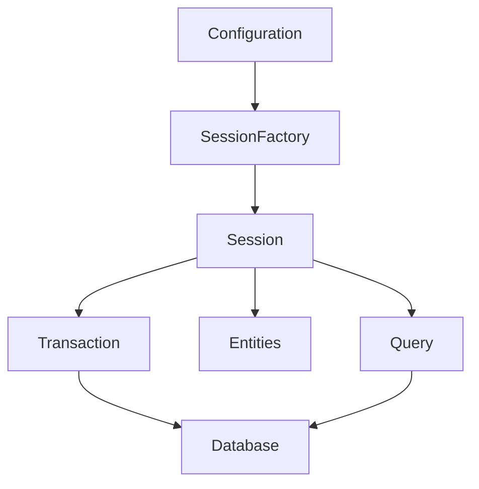
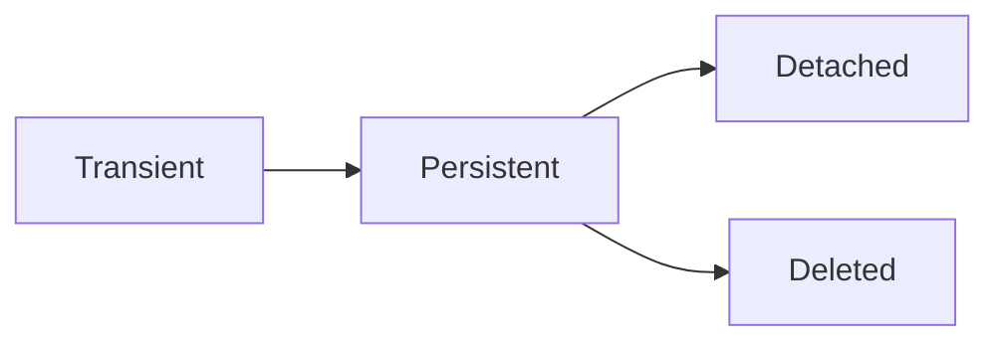
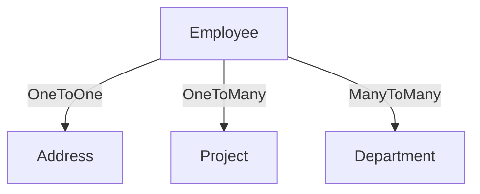

# JDBC & Transaction Management

## Introduction to JDBC API

**Java Database Connectivity (JDBC)** is a standard Java API for interacting with relational databases. It allows developers to execute SQL statements, retrieve results, and manage database connections.

### Key Features:
- Platform-independent connectivity.
- Supports CRUD (Create, Read, Update, Delete) operations.
- Facilitates transaction management and batch processing.
- Extensible through various JDBC drivers.

### JDBC Workflow:
1. Load the JDBC Driver.
2. Establish a connection to the database.
3. Create and execute SQL queries.
4. Process the results.
5. Close the resources.

---

## JDBC Architecture

JDBC architecture consists of two layers:

1. **JDBC API Layer:**
   - Provides methods and classes for interacting with databases.
2. **JDBC Driver Layer:**
   - Translates JDBC calls into vendor-specific database calls.

### Diagram:

```plaintext
Application
    |
    v
JDBC API
    |
    v
JDBC Driver Manager
    |
    v
Database-Specific Driver
    |
    v
Database
```

---

## JDBC Drivers

JDBC drivers act as an interface between the Java application and the database.

### Types of Drivers:

1. **Type 1: JDBC-ODBC Bridge Driver**
   - Uses ODBC drivers for database communication.
   - Pros: Easy to use.
   - Cons: Slower and platform-dependent.

2. **Type 2: Native-API Driver**
   - Uses native libraries of the database.
   - Pros: Faster than Type 1.
   - Cons: Platform-dependent.

3. **Type 3: Network Protocol Driver**
   - Communicates with middleware for database access.
   - Pros: Platform-independent, suitable for multi-tier applications.
   - Cons: Middleware required.

4. **Type 4: Thin Driver**
   - Directly converts JDBC calls to database-specific protocol.
   - Pros: Fast, platform-independent.
   - Cons: Requires a separate driver for each database.

### Table Comparison:

| Type    | Speed     | Platform Dependency | Middleware Required |
|---------|-----------|---------------------|---------------------|
| Type 1  | Slow      | Yes                 | No                  |
| Type 2  | Moderate  | Yes                 | No                  |
| Type 3  | Moderate  | No                  | Yes                 |
| Type 4  | Fast      | No                  | No                  |

---

## JDBC Classes & Interfaces

### Key Components:

1. **Driver**
   - Loads database-specific driver.
   - Example: `DriverManager.registerDriver(new MySQLDriver());`

2. **Connection**
   - Represents a connection to the database.
   - Example:

```java
Connection conn = DriverManager.getConnection("jdbc:mysql://localhost:3306/mydb", "user", "password");
```

3. **Statement**
   - Executes SQL queries.
   - Example:

```java
Statement stmt = conn.createStatement();
ResultSet rs = stmt.executeQuery("SELECT * FROM employees");
```

4. **PreparedStatement**
   - Precompiled SQL statements to prevent SQL injection.
   - Example:

```java
PreparedStatement pstmt = conn.prepareStatement("SELECT * FROM employees WHERE id = ?");
pstmt.setInt(1, 101);
ResultSet rs = pstmt.executeQuery();
```

5. **ResultSet**
   - Retrieves query results.
   - Example:

```java
while (rs.next()) {
    System.out.println("Name: " + rs.getString("name"));
}
```

---

## Stored Procedures and Functions Invocation

Stored procedures and functions are precompiled SQL statements stored in the database. JDBC allows invoking them using the `CallableStatement` interface.

### Example:

#### Stored Procedure (MySQL):
```sql
DELIMITER //
CREATE PROCEDURE getEmployeeName(IN empId INT, OUT empName VARCHAR(50))
BEGIN
    SELECT name INTO empName FROM employees WHERE id = empId;
END //
DELIMITER ;
```

#### Java Code:
```java
CallableStatement cstmt = conn.prepareCall("{CALL getEmployeeName(?, ?)}");
cstmt.setInt(1, 101);
cstmt.registerOutParameter(2, Types.VARCHAR);
cstmt.execute();
System.out.println("Employee Name: " + cstmt.getString(2));
```

---


## SQL Injection Overview and Prevention

### SQL Injection:
A security vulnerability where attackers inject malicious SQL queries to manipulate the database.

### Example:
#### Vulnerable Code:
```java
String query = "SELECT * FROM users WHERE username = '" + userInput + "'";
Statement stmt = conn.createStatement();
ResultSet rs = stmt.executeQuery(query);
```

#### Malicious Input:
```plaintext
' OR '1'='1
```

### Prevention:
1. Use `PreparedStatement`:
```java
PreparedStatement pstmt = conn.prepareStatement("SELECT * FROM users WHERE username = ?");
pstmt.setString(1, userInput);
ResultSet rs = pstmt.executeQuery();
```

2. Validate user inputs.
3. Use stored procedures.
4. Implement ORM frameworks (e.g., Hibernate).

---

## Design Pattern: Data Access Object (DAO) Pattern

The DAO pattern abstracts and encapsulates data access logic, separating it from business logic.

### Structure:

```plaintext
Controller -> Service -> DAO -> Database
```

### Example:

#### User.java (POJO):
```java
public class User {
    private int id;
    private String name;

    // Getters and Setters
}
```

#### UserDAO Interface:
```java
public interface UserDAO {
    User getUserById(int id);
    void saveUser(User user);
}
```

#### UserDAOImpl:
```java
public class UserDAOImpl implements UserDAO {
    private Connection conn;

    public UserDAOImpl(Connection conn) {
        this.conn = conn;
    }

    @Override
    public User getUserById(int id) throws SQLException {
        String query = "SELECT * FROM users WHERE id = ?";
        PreparedStatement pstmt = conn.prepareStatement(query);
        pstmt.setInt(1, id);
        ResultSet rs = pstmt.executeQuery();
        if (rs.next()) {
            User user = new User();
            user.setId(rs.getInt("id"));
            user.setName(rs.getString("name"));
            return user;
        }
        return null;
    }

    @Override
    public void saveUser(User user) throws SQLException {
        String query = "INSERT INTO users (name) VALUES (?)";
        PreparedStatement pstmt = conn.prepareStatement(query);
        pstmt.setString(1, user.getName());
        pstmt.executeUpdate();
    }
}
```

### Benefits:
- Simplifies data access logic.
- Promotes separation of concerns.
- Easy to test and maintain.

```
```


# J2EE Overview

Java 2 Platform, Enterprise Edition (J2EE), now known as Java EE (Enterprise Edition), is a set of specifications and technologies that enable the development of enterprise-level applications in Java. It provides a platform for building and deploying distributed, multi-tiered, and transactional web-based applications.

### Key Components of J2EE:
1. **Servlets**: A Java class used to extend the capabilities of servers hosting applications accessed by users.
2. **JSP (JavaServer Pages)**: A technology used for creating dynamic web pages with Java.
3. **EJB (Enterprise JavaBeans)**: A server-side component used for business logic.
4. **JDBC (Java Database Connectivity)**: A Java API that allows interaction with databases.
5. **JMS (Java Message Service)**: A messaging standard for sending messages between applications.
6. **JTA (Java Transaction API)**: A standard interface for managing transactions.

J2EE applications typically consist of components like web components (Servlets and JSPs) and enterprise components (EJBs, JCA, etc.).

---

## J2EE Container

A J2EE container is a runtime environment for J2EE components, managing the life cycle, security, transactions, and many other services of the components within an application.

### Types of Containers:
1. **Web Container**: Manages the execution of web components such as Servlets and JSPs.
2. **EJB Container**: Manages the execution of enterprise beans, including session beans, entity beans, and message-driven beans.
3. **Application Client Container**: Manages the execution of Java application clients that interact with the enterprise server.

### Responsibilities of the Container:
- **Component Management**: Creating, loading, and managing component lifecycle.
- **Security Management**: Managing access control and user authentication.
- **Transaction Management**: Coordinating transaction activities within components.
- **Resource Management**: Managing external resources like databases and messaging systems.

**Diagram**:
```
+---------------------------------------+
|            J2EE Application          |
|                                       |
|   +-----------+    +---------------+  |
|   | Web       |    | EJB           |  |
|   | Container |    | Container     |  |
|   +-----------+    +---------------+  |
|          |               |           |
|   +------------------+    |           |
|   | Servlet/JSP      |    |           |
|   +------------------+    |           |
|                          |           |
|   +------------------+    |           |
|   | Enterprise Bean  |    |           |
|   +------------------+    |           |
+---------------------------------------+
```

---

## Packaging Web Applications

Web applications in J2EE are packaged into **WAR (Web Archive)** files. A WAR file is a compressed archive that contains all the files required for a web application, such as HTML, JSP, Servlets, and other resources.

### Structure of a WAR File:
```
my-web-app.war
├── WEB-INF/
│   ├── classes/                # Compiled Java classes
│   ├── lib/                    # Libraries (JAR files)
│   ├── web.xml                 # Deployment descriptor (web.xml)
│   └── tlds/                   # Tag Library Descriptors (for custom tags)
├── index.html                  # Static HTML page
└── images/                     # Images and other static resources
```

- **WEB-INF/web.xml**: The deployment descriptor for a web application. It configures the servlets, servlet mappings, and other resources for the application.

---

## J2EE Compliant Web Application

A J2EE-compliant web application adheres to the Java EE specifications and can run on any application server that supports J2EE. This includes having the proper directory structure, deployment descriptors, and required libraries.

### Characteristics:
- It must have a `web.xml` descriptor under the `WEB-INF` directory.
- Should be packaged as a WAR file.
- Can use J2EE technologies like Servlets, JSP, EJBs, JDBC, and more.
- Must conform to security, transaction, and session management protocols defined by Java EE.

---

## Deployment Tools

Deployment tools are used to deploy J2EE applications to an application server or a cloud environment.

### Common Tools:
- **Ant**: A build tool used for automating the deployment process of web applications.
- **Maven**: A build and dependency management tool that can also deploy applications.
- **EJB Deployment Tool**: A tool to deploy EJB components to the EJB container.
- **J2EE Deployment Descriptor**: The `web.xml` (for web applications) and `ejb-jar.xml` (for EJBs) files provide the necessary configuration for the deployment.

### Deployment Process:
1. **Compile** the source code.
2. **Package** the application into a WAR or EAR file.
3. **Deploy** the packaged file to the application server (e.g., JBoss, GlassFish).
4. **Start** the application using the deployment tools or application server console.

---

## Web Application Life Cycle

The web application life cycle defines the phases that a web application goes through during its existence. It involves the management of requests, sessions, and responses.

### Phases:
1. **Initialization**: When the servlet is loaded into memory by the web container.
2. **Request Handling**: The servlet or JSP processes client requests.
3. **Response Generation**: The servlet or JSP generates the response (usually HTML).
4. **Destruction**: When the servlet is unloaded and the container shuts down.

### Flowchart:

```
+------------------+      +--------------------+      +-------------------+
|    Initialization| ---> |  Request Handling   | ---> |  Response Generation|
+------------------+      +--------------------+      +-------------------+
                                      |
                                      v
                                +------------------+
                                |    Destruction   |
                                +------------------+
```

---

## Deploying Web Applications

Web applications are deployed on J2EE-compliant servers like Tomcat, JBoss, or GlassFish. The deployment process typically involves:

1. **Create a WAR file**: Package the application.
2. **Upload the WAR file**: Upload to the application server's web deployment directory.
3. **Configure the server**: Ensure the server is configured for the correct deployment, including context path and resource mapping.
4. **Start the application**: Start the server, and the application will be available for users.

### Deployment Descriptor (`web.xml`):
```xml
<web-app>
    <servlet>
        <servlet-name>helloServlet</servlet-name>
        <servlet-class>com.example.HelloServlet</servlet-class>
    </servlet>
    <servlet-mapping>
        <servlet-name>helloServlet</servlet-name>
        <url-pattern>/hello</url-pattern>
    </servlet-mapping>
</web-app>
```

---

## Web Services Support

J2EE provides support for building and deploying web services, enabling communication between distributed applications over the internet. Web services in J2EE are typically implemented using SOAP or REST protocols.

### SOAP-based Web Services:
- SOAP (Simple Object Access Protocol) is a protocol for exchanging XML-based messages.
- JAX-RPC (Java API for XML-Based RPC) and JAX-WS (Java API for Web Services) are used for implementing SOAP services.

### RESTful Web Services:
- REST (Representational State Transfer) is an architectural style based on HTTP.
- JAX-RS (Java API for RESTful Web Services) is used to develop RESTful web services.

### Web Service Deployment:
1. **Create a WSDL (Web Service Definition Language)** document for SOAP.
2. **Publish the service** on the application server.
3. **Consume the service** from a client application.

### Diagram:
```
+-------------------------+
|    Web Service Consumer |
| (Client Application)    |
+-------------------------+
            |
            v
+-------------------------+
|   Web Service Endpoint  |
| (Server-Side Service)   |
+-------------------------+
            |
            v
+-------------------------+
|    SOAP or REST API     |
| (Communication Layer)   |
+-------------------------+
```


# Servlets: A Comprehensive Guide

## 1. Servlets: Dynamic Content Generation
Servlets are Java programs that run on a server and generate dynamic content in response to client requests, typically through HTTP. They are a crucial part of Java EE for building web applications.

### Features of Servlets:
- **Platform Independent**: Written in Java, making them portable across platforms.
- **Dynamic Content Generation**: Handles user input to produce dynamic responses like HTML, JSON, or XML.
- **Efficient and Scalable**: Eliminates the overhead of process creation, as they operate within a single JVM.

### Basic Example:
```java
import java.io.*;
import javax.servlet.*;
import javax.servlet.http.*;

public class HelloWorldServlet extends HttpServlet {
    protected void doGet(HttpServletRequest request, HttpServletResponse response)
            throws ServletException, IOException {
        response.setContentType("text/html");
        PrintWriter out = response.getWriter();
        out.println("<h1>Hello, World!</h1>");
    }
}
```

### Flowchart:
1. **Request**: Client sends an HTTP request.
2. **Servlet Container**: Passes the request to the servlet.
3. **Processing**: Servlet processes the request and generates a response.
4. **Response**: Sent back to the client.

---

## 2. Advantages of Servlets over CGI
| Feature                 | Servlets                                   | CGI (Common Gateway Interface)                  |
|-------------------------|--------------------------------------------|------------------------------------------------|
| **Performance**         | High, as servlets run in the JVM and reuse threads. | Low, as each request spawns a new process.     |
| **Scalability**         | Excellent, as they handle multiple requests in threads. | Poor, limited by process creation overhead.    |
| **Portability**         | Platform-independent (Java).              | Platform-dependent (based on language used).   |
| **Security**            | Integrated with Java security APIs.       | Limited security.                              |
| **Maintenance**         | Easier with centralized Java code.        | Harder due to script-based implementation.     |

---

## 3. Servlet Life Cycle
The servlet lifecycle is defined by the **javax.servlet.Servlet** interface.

### Stages:
1. **Loading and Instantiation**:
   - Servlet class is loaded into the JVM by the servlet container.
   - A single instance of the servlet is created.

2. **Initialization (`init` method)**:
   - Invoked once after instantiation.
   - Used for initialization code, such as setting up resources.
   ```java
   public void init(ServletConfig config) throws ServletException {
       super.init(config);
   }
   ```

3. **Request Handling (`service` method)**:
   - Handles client requests by calling `doGet`, `doPost`, etc.
   ```java
   public void service(ServletRequest req, ServletResponse res) throws ServletException, IOException {
       // Dynamic content generation logic
   }
   ```

4. **Destruction (`destroy` method)**:
   - Cleans up resources before servlet is destroyed.
   ```java
   public void destroy() {
       // Cleanup logic
   }
   ```

### Diagram:
```
[Loading] --> [Initialization (init)] --> [Request Handling (service)] --> [Destruction (destroy)]
```

---

## 4. Servlet API & Deployment
Servlets rely on the **Java Servlet API** provided by `javax.servlet` and `javax.servlet.http` packages.

### Deployment:
1. **Directory Structure**:
   ```
   webapp/
   ├── WEB-INF/
   │   ├── web.xml
   │   └── classes/
   │       └── HelloWorldServlet.class
   └── index.html
   ```

2. **web.xml Configuration**:
   ```xml
   <web-app>
       <servlet>
           <servlet-name>HelloWorldServlet</servlet-name>
           <servlet-class>HelloWorldServlet</servlet-class>
       </servlet>
       <servlet-mapping>
           <servlet-name>HelloWorldServlet</servlet-name>
           <url-pattern>/hello</url-pattern>
       </servlet-mapping>
   </web-app>
   ```

---

## 5. Servlet Annotations
Annotations simplify servlet deployment by eliminating the need for `web.xml`.

### Example:
```java
import javax.servlet.annotation.WebServlet;

@WebServlet("/hello")
public class HelloWorldServlet extends HttpServlet {
    protected void doGet(HttpServletRequest request, HttpServletResponse response)
            throws ServletException, IOException {
        response.getWriter().println("Hello, World!");
    }
}
```

---

## 6. The Servlet Interface
The **Servlet** interface defines the lifecycle methods:
- `init()`
- `service()`
- `destroy()`
- `getServletConfig()`
- `getServletInfo()`

---

## 7. The HttpServlet, HttpServletRequest, HttpServletResponse
### `HttpServlet`:
A subclass of `GenericServlet` that simplifies HTTP request handling.

### `HttpServletRequest`:
Encapsulates the client request. Useful methods:
- `getParameter(String name)`
- `getSession()`

### `HttpServletResponse`:
Encapsulates the server response. Useful methods:
- `setContentType(String type)`
- `getWriter()`

---

## 8. Exception Handling
### Types of Exceptions:
1. **ServletException**: General exceptions in servlets.
2. **IOException**: Input/output-related issues.

### Example:
```java
try {
    // Code
} catch (IOException e) {
    throw new ServletException("Error processing request", e);
}
```

### Error Page Configuration in `web.xml`:
```xml
<error-page>
    <error-code>404</error-code>
    <location>/error.jsp</location>
</error-page>
```

---

## 9. Servlet, DAO, POJO DB Layers
### Architecture:
1. **Servlet**: Handles HTTP requests and responses.
2. **DAO (Data Access Object)**: Encapsulates database operations.
3. **POJO (Plain Old Java Object)**: Represents data as objects.

### Example:
#### POJO:
```java
public class User {
    private int id;
    private String name;
    private String email;
    // Getters and Setters
}
```

#### DAO:
```java
public class UserDAO {
    public User getUserById(int id) {
        // Database code
        return user;
    }
}
```

#### Servlet:
```java
@WebServlet("/user")
public class UserServlet extends HttpServlet {
    protected void doGet(HttpServletRequest request, HttpServletResponse response)
            throws ServletException, IOException {
        UserDAO dao = new UserDAO();
        User user = dao.getUserById(1);
        response.getWriter().println("User: " + user.getName());
    }
}
```

---

# Session

## What is a Session?
A **session** represents a single interaction between a client and a server over a period of time. It helps maintain state information for a user across multiple HTTP requests, as HTTP is inherently stateless. Sessions are widely used in web applications to track user activities, such as login status, shopping cart contents, or preferences.

### Characteristics:
- Temporary: A session exists for a specific duration.
- User-specific: Each user has a unique session.
- Server-side: Most session data is stored on the server, ensuring better security.

### Session Lifecycle:
1. **Creation:** A session is created when a user accesses a web application for the first time.
2. **Usage:** Data is stored in the session for subsequent requests.
3. **Invalidation:** The session ends due to timeout or manual invalidation.

### Common Use Cases:
- Storing user login credentials.
- Keeping track of shopping cart items.
- Retaining user preferences.

---

# Session Management

## What is Session Management?
Session management refers to techniques used to maintain the state of a user across multiple HTTP requests. It ensures continuity of user interaction by associating data (like authentication information) with the user.

### Techniques for Session Management:
1. **Cookies:**
   - Stores session data on the client-side as key-value pairs.
   - Limited storage (typically 4 KB per cookie).
2. **URL Rewriting:**
   - Appends a session ID to the URL.
   - Example: `http://example.com;jsessionid=12345`
3. **Hidden Fields:**
   - Embeds session data in hidden form fields within web pages.
4. **HttpSession API (Java-specific):**
   - Stores session data on the server-side.

---

# Session Tracking

Session tracking is the process of identifying and tracking a user’s interaction with a web application. It ensures that the server recognizes subsequent requests from the same client.

## Techniques for Session Tracking:

### 1. Using Cookies
- **Definition:** Cookies are small text files stored on the client’s browser.
- **Working:**
  1. Server sends a `Set-Cookie` header to the browser.
  2. Browser stores the cookie and sends it back with each request using the `Cookie` header.

#### Example Code:
```java
// Setting a cookie
Cookie userCookie = new Cookie("username", "JohnDoe");
userCookie.setMaxAge(60 * 60); // 1 hour
response.addCookie(userCookie);

// Reading a cookie
Cookie[] cookies = request.getCookies();
if (cookies != null) {
    for (Cookie cookie : cookies) {
        if (cookie.getName().equals("username")) {
            String username = cookie.getValue();
        }
    }
}
```

#### Advantages:
- Easy to implement.
- No server storage required.

#### Disadvantages:
- Limited storage size.
- Can be disabled by users.
- Security risks if data isn’t encrypted.

### 2. Using HttpSession
- **Definition:** The `HttpSession` interface provides a way to store session data on the server.
- **Working:**
  1. The server creates a unique `JSESSIONID` for each session.
  2. This ID is sent to the client via cookies or URL rewriting.
  3. Session data is stored on the server and accessed using the session ID.

#### Example Code:
```java
// Creating a session and adding attributes
HttpSession session = request.getSession();
session.setAttribute("username", "JohnDoe");

// Retrieving session data
String username = (String) session.getAttribute("username");

// Invalidating a session
session.invalidate();
```

#### Advantages:
- Data stored securely on the server.
- Handles session timeout automatically (### 30 min by default).

#### Disadvantages:
- Increases server memory usage.
- Session replication is needed in a clustered environment.

---

# Request Dispatcher

## What is a Request Dispatcher?
The `RequestDispatcher` interface in Java is used to forward a request from one resource (such as a servlet) to another resource (servlet, JSP, or HTML file) within the same web application.

### Methods of RequestDispatcher:
1. **`forward()`**: Forwards the request and response to another resource on the server.
2. **`include()`**: Includes the content of another resource in the response.

#### Example Code:
```java
// Forwarding a request
RequestDispatcher rd = request.getRequestDispatcher("welcome.jsp");
rd.forward(request, response);

// Including a resource
RequestDispatcher rd = request.getRequestDispatcher("header.jsp");
rd.include(request, response);
```

### Forward vs Include:
| Feature          | Forward                                   | Include                                    |
|------------------|------------------------------------------|-------------------------------------------|
| Purpose          | Transfers control to another resource    | Embeds content of another resource        |
| URL Changes      | No                                       | No                                        |
| Execution Flow   | Stops after forwarding                   | Continues after including                 |

---

# Page Navigation

Page navigation refers to guiding users between different web pages in a web application. It is commonly achieved using:
1. **Hyperlinks:** Static navigation using `<a>` tags.
2. **Form Submissions:** Dynamic navigation using `<form>` elements.
3. **Request Dispatcher:** Server-side navigation using servlets.

#### Example of Hyperlink:
```html
<a href="products.jsp">View Products</a>
```

#### Example of Form Submission:
```html
<form action="LoginServlet" method="POST">
    <input type="text" name="username" />
    <button type="submit">Login</button>
</form>
```

---

# Case Study: Servlet-Based Application

## Use Case: User Authentication System

### Requirements:
1. A login page for user authentication.
2. Session management to track user login.
3. Logout functionality.

### Folder Structure:
```
web-app/
├── webapp/
│   ├── index.html          # Login page
│   ├── dashboard.jsp       # User dashboard
│   └── logout.jsp          # Logout page
├── src/
│   ├── LoginServlet.java   # Handles login requests
│   └── LogoutServlet.java  # Handles logout requests
├── web.xml                 # Servlet mappings
```

### Code Implementation:

#### 1. `index.html`
```html
<!DOCTYPE html>
<html>
<head>
    <title>Login</title>
</head>
<body>
    <form action="LoginServlet" method="POST">
        <label>Username:</label>
        <input type="text" name="username" required />
        <label>Password:</label>
        <input type="password" name="password" required />
        <button type="submit">Login</button>
    </form>
</body>
</html>
```

#### 2. `LoginServlet.java`
```java
@WebServlet("/LoginServlet")
public class LoginServlet extends HttpServlet {
    protected void doPost(HttpServletRequest request, HttpServletResponse response) throws ServletException, IOException {
        String username = request.getParameter("username");
        String password = request.getParameter("password");

        if ("admin".equals(username) && "password123".equals(password)) {
            HttpSession session = request.getSession();
            session.setAttribute("user", username);
            response.sendRedirect("dashboard.jsp");
        } else {
            response.getWriter().println("Invalid credentials!");
        }
    }
}
```

#### 3. `LogoutServlet.java`
```java
@WebServlet("/LogoutServlet")
public class LogoutServlet extends HttpServlet {
    protected void doGet(HttpServletRequest request, HttpServletResponse response) throws ServletException, IOException {
        HttpSession session = request.getSession();
        session.invalidate();
        response.sendRedirect("index.html");
    }
}
```

#### 4. `dashboard.jsp`
```jsp
<%
    HttpSession session = request.getSession(false);
    if (session == null || session.getAttribute("user") == null) {
        response.sendRedirect("index.html");
    }
%>
<h1>Welcome, <%= session.getAttribute("user") %>!</h1>
<a href="LogoutServlet">Logout</a>
```

---


# **JSP: Separating UI from Content Generation Code**

JavaServer Pages (JSP) is a technology used to create dynamic web content by embedding Java code into HTML pages. The main idea behind JSP is to separate the user interface (UI) from the content generation logic, promoting maintainability, reusability, and modularity.

### Why Separate UI from Content Generation?
- **Maintainability:** By separating the logic and presentation, developers can modify the business logic and UI independently.
- **Reusability:** UI and content generation logic can be reused across different pages or applications.
- **Improved Collaboration:** Developers can work on business logic and UI design simultaneously without interfering with each other.

### **How JSP Achieves Separation:**
- **JSP Pages:** These contain the HTML content (UI) mixed with special JSP tags that allow interaction with Java.
- **Servlets:** Java classes (servlets) handle the business logic and dynamic content generation.
- **JavaBeans:** Reusable components that encapsulate data and logic, often used to interact with JSP.

#### Example:
```jsp
<!-- index.jsp -->
<html>
<body>
    <h2>Welcome, ${userName}!</h2> <!-- Dynamically generated from backend -->
</body>
</html>
```
In this example, the UI is displayed using HTML, while the content (userName) is dynamically generated using Java, such as from a servlet or JavaBean.

---

# **MVC Architecture**

MVC (Model-View-Controller) is an architectural design pattern used in web development to separate the concerns of data handling, UI presentation, and user interaction.

### Components of MVC:
1. **Model:** Represents the data and the business logic of the application. It interacts with the database to retrieve and manipulate data.
2. **View:** The UI part that displays data to the user. It contains the layout and design of the page.
3. **Controller:** Acts as an intermediary between the Model and View. It handles user requests, processes them, and updates the Model or View accordingly.

### How MVC Works:
- The **Controller** receives user input (requests) and updates the **Model**.
- The **Model** then updates the **View** to reflect the new data.
- The **View** displays the updated data to the user.

#### Diagram:

```
      User
       ↓
   Controller  ←→ Model ←→ Database
       ↑
     View
```

---

# **Design Pattern: MVC Pattern**


The MVC (Model-View-Controller) pattern is a widely used software design pattern that decouples the user interface (View) from the business logic (Model) and user input (Controller).

### Benefits of MVC:
- **Separation of Concerns:** Different layers handle distinct aspects of the application.
- **Maintainability:** Since the business logic and UI are separate, maintaining the application becomes easier.
- **Scalability:** As the complexity of an application grows, it is easier to scale and extend the application by modifying individual components.

### Detailed Flow:
1. **Request:** The user interacts with the View (UI) through a browser (click, form submit, etc.).
2. **Controller:** The Controller receives the request and processes it (via business logic in the Model).
3. **Model:** The Model handles data retrieval and manipulation, often interacting with a database.
4. **View:** After processing, the Controller updates the View with the new data for display.

---

# **Life Cycle of a JSP Page**

The life cycle of a JSP page refers to the various stages a JSP page goes through from its creation to its destruction.

### Stages of JSP Life Cycle:

1. **Translation:** The JSP file is translated into a Servlet by the container (such as Apache Tomcat).
2. **Compilation:** The generated Servlet is compiled into bytecode.
3. **Instantiation:** The JSP servlet is instantiated.
4. **Initialization:** The `init()` method is called, and any initialization code is executed.
5. **Request Handling:** The `service()` method handles each request and generates dynamic content.
6. **Destroy:** When the JSP is no longer needed, the `destroy()` method is called, and the servlet is removed from memory.

#### Flowchart:
```
+------------------+        +------------------+        +----------------------+
|  Request for JSP |  --->  |  JSP Translated  |  --->  |  JSP Servlet Created  |
+------------------+        +------------------+        +----------------------+
                               ↓                        |
                       +---------------------+          ↓
                       | Servlet Initialization|        |
                       +---------------------+        |
                               ↓                        |
                       +---------------------+        |
                       | Processing Request  |        |
                       +---------------------+        |
                               ↓                        |
                      +------------------------+       |
                      | JSP Output Generated   |       |
                      +------------------------+       |
                               ↓                        |
                       +-------------------+            |
                       | JSP Servlet Destroyed | <------+
                       +-------------------+
```

---

# **Directives, Implicit and Explicit Objects, Scriptlets, Expressions, Expression Language**

### **Directives:**
JSP directives provide global information to the JSP engine. They define properties of the entire JSP page. Common directives include:
- **Page Directive:** Specifies page-level settings.
  ```jsp
  <%@ page language="java" contentType="text/html; charset=ISO-8859-1" %>
  ```

- **Include Directive:** Includes another file during the translation phase.
  ```jsp
  <%@ include file="header.jsp" %>
  ```

### **Implicit Objects:**
JSP provides several predefined objects (implicitly available) that developers can use to interact with the environment.

| Object           | Description                                       |
|------------------|---------------------------------------------------|
| `request`        | Represents the HTTP request sent by the client.   |
| `response`       | Represents the HTTP response sent to the client.  |
| `out`            | A `JspWriter` object used to send output to the client. |
| `session`        | Represents the session between the client and the server. |
| `application`    | Represents the servlet context for the entire web application. |
| `config`         | Contains initialization parameters of the servlet. |
| `pageContext`    | Provides access to various JSP page attributes. |

### **Scriptlets:**
Scriptlets allow embedding Java code inside a JSP page.

```jsp
<% 
   String user = "JohnDoe"; 
   out.println("Hello, " + user); 
%>
```

### **Expressions:**
An expression evaluates a Java expression and outputs the result to the response.

```jsp
<%= 2 + 2 %>  <!-- Outputs: 4 -->
```

### **Expression Language (EL):**
EL simplifies the syntax to access data in a JSP page. It removes the need for scriptlets.

```jsp
${userName} <!-- Accesses the 'userName' variable -->
```

---

# **Scope**

The scope in JSP determines the visibility and lifetime of objects.

| Scope        | Description                                             |
|--------------|---------------------------------------------------------|
| **Page Scope**    | The object is accessible only within the current JSP page. |
| **Request Scope** | The object is accessible across different JSP pages in the same request. |
| **Session Scope** | The object is accessible throughout the user's session. |
| **Application Scope** | The object is accessible across the entire web application. |

### Example:
```jsp
<% 
   pageContext.setAttribute("message", "Hello from PageScope");
%>
```

---

# **JSP Error Page Handling**

JSP provides mechanisms to handle errors and display custom error pages.

### How to Define an Error Page:
1. **In the JSP Page:**
   ```jsp
   <%@ page errorPage="error.jsp" %>
   ```
2. **In the `web.xml` Deployment Descriptor:**
   ```xml
   <error-page>
       <exception-type>java.lang.Exception</exception-type>
       <location>/error.jsp</location>
   </error-page>
   ```

### Error Handling Example:
```jsp
<%@ page isErrorPage="true" %>
<html>
<body>
    <h2>Error: ${exception}</h2>
</body>
</html>
```

---

# **JSTL (JavaServer Pages Standard Tag Library)**

JSTL provides a set of tags to simplify common tasks like iteration, conditionals, and database access.

### Key JSTL Tags:
- **Core Tags:** For iteration, conditionals, and variable handling.
  - `<c:forEach>`: Used for iterating over collections.
  - `<c:if>`: Conditional tag for executing logic.
  
```jsp
<c:forEach var="user" items="${users}">
    <p>${user.name}</p>
</c:forEach>
```

- **Formatting Tags:** For formatting dates, numbers, etc.
  - `<fmt:formatDate>`: Formats a date.
  
```jsp
<fmt:formatDate value="${currentDate}" pattern="yyyy-MM-dd" />
```

- **SQL Tags:** For database operations.
  - `<sql:query>`: Executes a SQL query.

```
```

# Hibernate Framework Deep Dive

## Introduction to Hibernate Framework

Hibernate is an **open-source Object-Relational Mapping (ORM) framework** for Java. It simplifies the development of Java applications by providing a framework to map Java objects to database tables and vice versa. By abstracting away the complexities of JDBC and SQL, Hibernate allows developers to focus on business logic rather than database connectivity.

### Key Features:
- **Lightweight and Open-Source:** Hibernate is freely available and easy to integrate.
- **ORM Tool:** Maps Java objects to relational database tables.
- **Database Independence:** Supports multiple databases, enabling easy portability.
- **HQL (Hibernate Query Language):** An object-oriented query language similar to SQL.
- **Caching:** Supports first-level and second-level caching for better performance.
- **Automatic Table Generation:** Automatically creates and updates database tables based on entity mappings.
- **Transaction Management:** Integrates seamlessly with JTA and other transaction management APIs.

---

## Hibernate Architecture

The architecture of Hibernate consists of the following core components:

### 1. **SessionFactory**
- A heavyweight object that provides Session objects.
- Created once per application and is thread-safe.

### 2. **Session**
- Represents a single unit of work with the database.
- Provides methods for CRUD operations.

### 3. **Transaction**
- Manages transaction boundaries.
- Ensures data consistency and rollback in case of failures.

### 4. **Query**
- Provides methods to execute HQL or native SQL queries.

### 5. **Configuration**
- Reads the `hibernate.cfg.xml` file or annotations to initialize Hibernate.
- Configures database settings and mapping files.

### 6. **Entities**
- Java classes that represent database tables.

#### Hibernate Architecture Diagram:


---

## Hibernate in IDE

### Creating a Web Application Using Hibernate API
1. **Setup Project:**
   - Create a Maven or Gradle project.
   - Add Hibernate and database dependencies to `pom.xml` or `build.gradle`.

2. **Configure Hibernate:**
   - Create `hibernate.cfg.xml`:
     ```xml
     <?xml version="1.0"?>
     <!DOCTYPE hibernate-configuration PUBLIC
       "-//Hibernate/Hibernate Configuration DTD 3.0//EN"
       "http://hibernate.sourceforge.net/hibernate-configuration-3.0.dtd">
     <hibernate-configuration>
         <session-factory>
             <property name="hibernate.connection.driver_class">com.mysql.cj.jdbc.Driver</property>
             <property name="hibernate.connection.url">jdbc:mysql://localhost:3306/mydb</property>
             <property name="hibernate.connection.username">root</property>
             <property name="hibernate.connection.password">password</property>
             <property name="hibernate.dialect">org.hibernate.dialect.MySQLDialect</property>
             <property name="hibernate.hbm2ddl.auto">update</property>
         </session-factory>
     </hibernate-configuration>
     ```

3. **Create Entity Class:**
   ```java
   @Entity
   @Table(name = "Employee")
   public class Employee {
       @Id
       @GeneratedValue(strategy = GenerationType.IDENTITY)
       private int id;

       private String name;

       private String department;

       // Getters and setters
   }
   ```

4. **Perform CRUD Operations:**
   ```java
   SessionFactory factory = new Configuration().configure().buildSessionFactory();
   Session session = factory.openSession();
   Transaction tx = session.beginTransaction();

   Employee emp = new Employee();
   emp.setName("John");
   emp.setDepartment("IT");

   session.save(emp);
   tx.commit();
   session.close();
   ```

### Lifecycle of Hibernate Entities
1. **Transient State:** Object is created but not associated with Hibernate.
2. **Persistent State:** Object is associated with a Session and mapped to a database.
3. **Detached State:** Object is no longer associated with a Session.

#### Entity Lifecycle Diagram:


---

## Hibernate with Annotations Example

Annotations in Hibernate simplify mapping by using Java metadata instead of XML files.

### Example:
```java
@Entity
@Table(name = "Product")
public class Product {

    @Id
    @GeneratedValue(strategy = GenerationType.IDENTITY)
    private int id;

    @Column(name = "product_name")
    private String name;

    private double price;

    // Getters and setters
}
```

---

## Hibernate Mappings and Relationships

### Types of Mappings:
1. **One-to-One Mapping**
   ```java
   @OneToOne
   @JoinColumn(name = "address_id")
   private Address address;
   ```

2. **One-to-Many Mapping**
   ```java
   @OneToMany(mappedBy = "employee")
   private List<Project> projects;
   ```

3. **Many-to-Many Mapping**
   ```java
   @ManyToMany
   @JoinTable(
       name = "employee_project",
       joinColumns = @JoinColumn(name = "employee_id"),
       inverseJoinColumns = @JoinColumn(name = "project_id")
   )
   private List<Project> projects;
   ```

### Relationship Diagram:


---

## Collection and Component Mapping

### Collection Mapping:
- Used for mapping collections like `List`, `Set`, `Map`.

```java
@Entity
public class Department {

    @Id
    private int id;

    @ElementCollection
    @CollectionTable(name = "employees", joinColumns = @JoinColumn(name = "department_id"))
    @Column(name = "employee_name")
    private List<String> employees;
}
```

### Component Mapping:
- Embeds a dependent object within another entity.

```java
@Embeddable
public class Address {
    private String city;
    private String state;
}

@Entity
public class Employee {
    @Embedded
    private Address address;
}
```

---

## HQL, Named Queries, and Criteria Queries

### HQL (Hibernate Query Language):
A powerful query language similar to SQL, but it works with entities instead of tables.

```java
List<Employee> employees = session.createQuery("FROM Employee WHERE department = 'IT'").list();
```

### Named Queries:
Predefined queries that can be reused.

```java
@NamedQuery(name = "findByDepartment", query = "FROM Employee WHERE department = :dept")
public class Employee {
}
```

### Criteria Queries:
API for building queries programmatically.

```java
CriteriaBuilder builder = session.getCriteriaBuilder();
CriteriaQuery<Employee> query = builder.createQuery(Employee.class);
Root<Employee> root = query.from(Employee.class);
query.select(root).where(builder.equal(root.get("department"), "IT"));
List<Employee> employees = session.createQuery(query).getResultList();
```

---

## JPQL (Java Persistence Query Language)
JPQL is a query language defined as part of JPA (Java Persistence API). It is similar to HQL and operates on entity objects rather than database tables.

### Features:
- Database-independent.
- Object-oriented.
- Supports joins, grouping, and aggregation.

### Example:
#### Basic Query:
```java
TypedQuery<User> query = entityManager.createQuery("SELECT u FROM User u WHERE u.name = :name", User.class);
query.setParameter("name", "John");
List<User> users = query.getResultList();
```

#### Aggregation Query:
```java
Query query = entityManager.createQuery("SELECT COUNT(u) FROM User u");
Long userCount = (Long) query.getSingleResult();
```

#### Joins:
```java
TypedQuery<Order> query = entityManager.createQuery("SELECT o FROM Order o JOIN o.user u WHERE u.name = :name", Order.class);
query.setParameter("name", "John");
List<Order> orders = query.getResultList();
```

### JPQL vs SQL:
| Feature               | JPQL                          | SQL                           |
|-----------------------|-------------------------------|-------------------------------|
| Operates on           | Entity objects                | Database tables               |
| Database dependency   | No                            | Yes                           |
| Abstraction           | High                          | Low                           |

---
---

# Lazy vs Eager Initialization in Hibernate

In the context of Hibernate, **Lazy Initialization** and **Eager Initialization** are strategies used to load associated entities (i.e., related objects) from the database. These strategies control when and how related data is fetched and can significantly impact the performance of a Hibernate-based application.

## 1. Lazy Initialization

- **Lazy Initialization** means that associated entities (like collections or other objects) are not loaded from the database until they are actually accessed for the first time.
- Hibernate creates proxy objects for the related entities, and these proxies are loaded only when a method or property of the entity is accessed.
- The goal is to avoid unnecessary database queries and reduce memory usage by loading data only when it's needed.
  
### How it works:
- If an entity is lazily loaded, Hibernate will initially fetch only the main entity from the database.
- If any of its associated entities or collections are accessed later, Hibernate will execute a database query to fetch the data for those associations.

### Example:
```java
@Entity
public class Department {
    @Id
    private int id;

    @OneToMany(fetch = FetchType.LAZY)
    private List<Employee> employees;
}
```
In this example, the `employees` list is lazily loaded. When you load a `Department` entity, the list of employees is not loaded until you explicitly access it (e.g., `department.getEmployees()`).

### Pros:
- **Reduced Memory Usage**: Since associated data is only fetched when needed.
- **Improved Performance**: If you don’t need related entities, they won’t be loaded, which avoids unnecessary database queries.

### Cons:
- **LazyInitializationException**: If the session is closed before you access the lazy-loaded data (e.g., accessing the collection after the session has been closed), you might encounter a `LazyInitializationException`.

---

## 2. Eager Initialization

- **Eager Initialization** means that associated entities are loaded immediately when the parent entity is loaded, even if you don't access them explicitly.
- Hibernate fetches all related data in a single query (or a join query) when loading the parent entity, which means that the associated entities are retrieved immediately, regardless of whether you will use them or not.
  
### How it works:
- If an entity is eagerly loaded, Hibernate will issue a query that includes the related entities, often using `JOIN` to retrieve both the parent and child entities in one go.

### Example:
```java
@Entity
public class Department {
    @Id
    private int id;

    @OneToMany(fetch = FetchType.EAGER)
    private List<Employee> employees;
}
```
In this example, the `employees` list will be loaded immediately when the `Department` entity is loaded, regardless of whether you access it later.

### Pros:
- **No LazyInitializationException**: Since related data is already fetched with the parent entity, you don’t risk encountering this exception.
- **Convenient**: All associated data is available as soon as the entity is loaded, so you don’t have to worry about loading it later.

### Cons:
- **Performance Overhead**: If the associated entities are large or if you don’t need them, fetching them eagerly can be inefficient. It can lead to unnecessary database queries, increased memory usage, and slower performance.
- **N+1 Query Problem**: If you're using eager fetching with associations like `@OneToMany`, it could result in multiple queries being executed (e.g., loading the parent entity first, then loading each associated entity separately), which can be very inefficient.

---

## Comparison of Lazy vs Eager Initialization

| Feature                         | **Lazy Initialization**                      | **Eager Initialization**                     |
|----------------------------------|----------------------------------------------|----------------------------------------------|
| **When are associated entities fetched?** | Only when accessed explicitly.             | Immediately, when the parent entity is loaded.|
| **Performance impact**           | Better, since related entities are not fetched unless needed. | May reduce performance due to unnecessary loading of data. |
| **Use case**                     | Suitable for large or optional associations. | Suitable when associated data is always needed. |
| **Risk of LazyInitializationException** | Yes, if the session is closed before accessing the entity. | No, because data is fetched immediately. |
| **Database queries**             | One query for the parent, additional queries when accessing associated data. | One query that loads both parent and associated data. |
| **Example** | @OneToMany, @ManyToMany | @ManyToOne, @OneToOne |
---

## Fetch Types in Hibernate Annotations

- **`FetchType.LAZY`**: Hibernate will fetch the association data only when it is accessed. This is the default fetch type for most relationships (e.g., `@OneToMany`, `@ManyToMany`).
- **`FetchType.EAGER`**: Hibernate will fetch the association data immediately when the parent entity is loaded. This is the default for `@ManyToOne` and `@OneToOne` relationships.

## Handling Lazy Initialization Exception

To avoid `LazyInitializationException`, you have several strategies:
1. **Open Session in View**: Keep the session open during the entire request to allow lazy loading while accessing related entities.
2. **Fetch the Data Eagerly**: Change the fetch type to `EAGER` if you know that the related entities will always be needed.
3. **Use DTOs**: Retrieve only the necessary data using `JOIN FETCH` in your queries or use DTOs to limit the data fetched.

---

---
# Spring Framework Overview

## **What is Spring Framework?**
The **Spring Framework** is a powerful, lightweight, and widely-used framework for building enterprise Java applications. It provides comprehensive support for infrastructure-level tasks, enabling developers to focus on application-level business logic.

### Key Features:
1. **Dependency Injection (DI):** Simplifies object creation and management.
2. **Aspect-Oriented Programming (AOP):** Facilitates separation of cross-cutting concerns like logging and security.
3. **Modularity:** Composed of various modules, each serving specific functionality.
4. **Integration:** Supports integration with other frameworks (e.g., Hibernate, JPA, and Struts).
5. **MVC Framework:** Simplifies the development of web applications.

---

## **Overview of Spring Architecture**

The Spring Framework is built on a modular architecture. Its core is the **Inversion of Control (IoC)** container, and it extends support through additional modules for web applications, data access, security, and more.

### Key Layers in Spring Architecture:
1. **Core Container:**
   - Includes **Beans**, **Core**, **Context**, and **Expression Language** modules.
   - Responsible for dependency injection and providing a runtime environment for managing beans.

2. **Data Access/Integration Layer:**
   - Supports JDBC, ORM, JMS, and transactions.
   - Provides abstraction over data access.

3. **Web Layer:**
   - Includes **Spring MVC** for web application development.
   - Provides features like RESTful web services, templating, and view resolution.

4. **AOP and Instrumentation Layer:**
   - Enables aspect-oriented programming.
   - Allows for custom behavior to be added to objects dynamically.

5. **Test Layer:**
   - Supports unit and integration testing of Spring applications.

---

## **Spring MVC Architecture**

The Spring MVC (Model-View-Controller) framework is a key part of Spring, designed to simplify web application development.


### Key Components of Spring MVC:
1. **DispatcherServlet:**
   - Acts as the front controller, handling all incoming HTTP requests.
   - Delegates requests to appropriate handlers.

2. **Controller:**
   - Handles user input and processes business logic.
   - Returns a `ModelAndView` object.

3. **Model:**
   - Holds application data.
   - Shared between the controller and the view.

4. **View:**
   - Represents the user interface (UI).
   - Renders model data as HTML, JSON, XML, etc.

### Spring MVC Workflow:
1. A user sends a request to the server.
2. The **DispatcherServlet** intercepts the request.
3. It consults the **Handler Mapping** to identify the appropriate controller.
4. The controller processes the request and updates the **Model**.
5. The **View Resolver** identifies the appropriate view for rendering.
6. The view is rendered and sent back to the user.

---

## **Spring Modules Overview**

Spring is composed of several modules organized into the following categories:


1. **Core Container:**
   - **Beans:** Provides the BeanFactory for DI.
   - **Core:** Provides fundamental parts of the framework.
   - **Context:** Offers the ApplicationContext for advanced features like internationalization and lifecycle events.
   - **Expression Language (EL):** Used for querying and manipulating objects.

2. **Data Access/Integration:**
   - **JDBC:** Simplifies database access.
   - **ORM:** Integrates with Hibernate, JPA, etc.
   - **JMS:** Supports Java Messaging Service.
   - **Transactions:** Manages programmatic and declarative transactions.

3. **Web:**
   - **Spring MVC:** Facilitates web application development.
   - **WebSocket:** Supports full-duplex communication.
   - **Servlet:** Integrates with Java Servlet API.

4. **AOP, Aspects, and Instrumentation:**
   - Provides support for AOP and dynamic proxies.

5. **Test:**
   - Supports testing of Spring components using JUnit or TestNG.

---

## **Understanding Spring 4 Annotations (Basic Introduction)**

Spring 4 introduced many annotations to simplify development by eliminating XML-based configuration. Here are some key annotations:


1. **@Component:** Marks a class as a Spring-managed component.
2. **@Controller:** Indicates that a class serves as a web controller in Spring MVC.
3. **@Service:** Denotes a service-layer component.
4. **@Repository:** Specialization of `@Component` for data access.
5. **@Autowired:** Enables automatic dependency injection.
6. **@Configuration:** Marks a class as a source of bean definitions.
7. **@Bean:** Indicates a method produces a Spring bean.
8. **@RestController:** Combines `@Controller` and `@ResponseBody` for RESTful web services.
9. **@RequestMapping:** Maps HTTP requests to handler methods.
10. **@Transactional:** Manages transactions declaratively.

---

## **What is IoC (Inversion of Control)?**

**Inversion of Control (IoC)** is a design principle that transfers the control of object creation and dependency management from the application to the framework.

### Key Concepts:
- **Dependency Injection (DI):** Objects are provided their dependencies by the IoC container.
- **Control Reversal:** Instead of the application controlling the flow, the framework controls it.

### Benefits:
- Simplifies code by managing object lifecycles.
- Enhances testability by using mock objects.
- Reduces tight coupling between components.

---

## **IoC Container**

The **IoC Container** is the core of Spring. It is responsible for managing the lifecycle, configuration, and dependencies of beans.

### Types of IoC Containers:
1. **BeanFactory:**
   - Basic container.
   - Lazily initializes beans (only when needed).

2. **ApplicationContext:**
   - More advanced container with additional features like internationalization and event handling.
   - Eagerly initializes beans.

### Core Features:
1. **Bean Definition:** Metadata about beans, such as dependencies and scopes, are defined in XML or annotations.
2. **Dependency Injection:** Handles injection of beans via constructor or setter injection.
3. **Bean Scope:** Supports different scopes like `singleton`, `prototype`, etc.

### Example: IoC Container in Action
```java
@Configuration
public class AppConfig {
    @Bean
    public MyService myService() {
        return new MyService();
    }
}

public class Main {
    public static void main(String[] args) {
        ApplicationContext context = new AnnotationConfigApplicationContext(AppConfig.class);
        MyService service = context.getBean(MyService.class);
        service.performTask();
    }
}
```
---

## **Dependency Injection**
**Dependency Injection (DI)** is a design pattern that allows a class to receive its dependencies from an external source rather than creating them internally.

### Types of Dependency Injection in Spring:
1. **Constructor Injection:**
   - Dependencies are provided via the class constructor.
   ```java
   public class Example {
       private final Dependency dependency;

       public Example(Dependency dependency) {
           this.dependency = dependency;
       }
   }
   ```

2. **Setter Injection:**
   - Dependencies are provided via setter methods.
   ```java
   public class Example {
       private Dependency dependency;

       public void setDependency(Dependency dependency) {
           this.dependency = dependency;
       }
   }
   ```

3. **Field Injection:**
   - Dependencies are injected directly into fields using annotations (e.g., `@Autowired`).
   ```java
   @Component
   public class Example {
       @Autowired
       private Dependency dependency;
   }
   ```

---

## **Spring Beans**
A **Spring Bean** is an object managed by the Spring IoC container. Beans are the backbone of a Spring application, and their lifecycle is controlled by the container.

### Defining Beans:
1. **Using XML Configuration:**
   ```xml
   <bean id="exampleBean" class="com.example.Example"/>
   ```

2. **Using Annotations:**
   - Annotate the class with `@Component`, `@Service`, `@Repository`, or `@Controller`.
   ```java
   @Component
   public class Example {
   }
   ```

3. **Using Java Configurations:**
   - Define beans in a configuration class using the `@Bean` annotation.
   ```java
   @Configuration
   public class AppConfig {
       @Bean
       public Example exampleBean() {
           return new Example();
       }
   }
   ```

---

## **Autowiring Beans**
**Autowiring** automatically resolves and injects bean dependencies without explicit configuration.

### Autowiring Modes:
1. **@Autowired:** Automatically wires a bean by type.
   ```java
   @Autowired
   private Example example;
   ```

2. **@Qualifier:** Used to resolve ambiguity when multiple beans of the same type exist.
   ```java
   @Autowired
   @Qualifier("specificBean")
   private Example example;
   ```

3. **@Primary:** Marks a bean as the default choice when multiple beans are available.
   ```java
   @Bean
   @Primary
   public Example defaultExample() {
       return new Example();
   }
   ```

---

## **Bean Scopes**
Spring supports several bean scopes to define the lifecycle and visibility of beans.

### Common Scopes:
1. **Singleton (Default):**
   - A single instance per Spring IoC container.
   ```java
   @Scope("singleton")
   ```

2. **Prototype:**
   - A new instance is created every time the bean is requested.
   ```java
   @Scope("prototype")
   ```

3. **Request:**
   - One instance per HTTP request (used in web applications).
   ```java
   @Scope(value = WebApplicationContext.SCOPE_REQUEST)
   ```

4. **Session:**
   - One instance per HTTP session (used in web applications).
   ```java
   @Scope(value = WebApplicationContext.SCOPE_SESSION)
   ```

---

## **Spring MVC**
Spring MVC is a web framework built on the Model-View-Controller design pattern, simplifying web application development.

### Components of Spring MVC:
1. **DispatcherServlet:**
   - The front controller that handles all HTTP requests and responses.

2. **Controller:**
   - Processes user requests and interacts with the service layer.

3. **Model:**
   - Holds application data and passes it between the controller and the view.

4. **View:**
   - Represents the user interface and displays data from the model.

---

## **Model, ModelAndView, HandlerMapping, and ViewResolver**

### **Model:**
- Used to store data and pass it from the controller to the view.
- Example:
  ```java
  @Controller
  public class ExampleController {
      @GetMapping("/example")
      public String showExample(Model model) {
          model.addAttribute("message", "Hello, Spring MVC!");
          return "exampleView";
      }
  }
  ```

### **ModelAndView:**
- Combines the model data and view name into a single object.
- Example:
  ```java
  @Controller
  public class ExampleController {
      @GetMapping("/example")
      public ModelAndView showExample() {
          ModelAndView mav = new ModelAndView("exampleView");
          mav.addObject("message", "Hello, Spring MVC!");
          return mav;
      }
  }
  ```

### **HandlerMapping:**
- Maps HTTP requests to appropriate controller methods.
- Example:
  ```java
  @RequestMapping("/example")
  public String handleRequest() {
      return "viewName";
  }
  ```

### **ViewResolver:**
- Resolves logical view names to actual views (e.g., JSP, Thymeleaf).
- Example:
  ```java
  @Configuration
  public class WebConfig implements WebMvcConfigurer {
      @Bean
      public InternalResourceViewResolver viewResolver() {
          InternalResourceViewResolver resolver = new InternalResourceViewResolver();
          resolver.setPrefix("/WEB-INF/views/");
          resolver.setSuffix(".jsp");
          return resolver;
      }
  }
  ```


