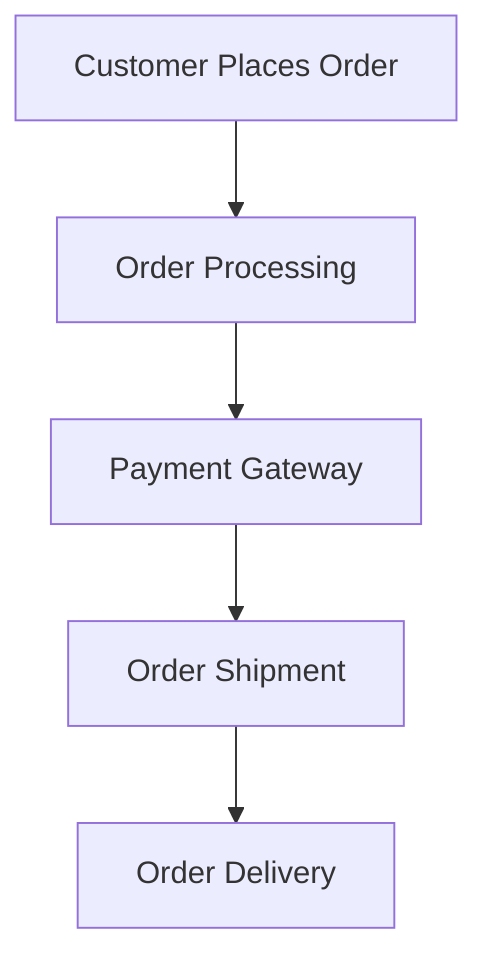

# Solution

## Project
**PPP**

## People
### Team Members:
- **MR**: Management Representative (Product Owner)
- **BA**: Business Analyst
- **SA**: System Analyst
- **Solution Architect**
- **Developers**
- **Testers**
- **Contributors**

## Process: SDLC
### Software Development Life Cycle Phases:
1. **Analysis**
2. **Design**
3. **Development**
4. **Testing**
5. **Deployment**
6. **Maintenance (Support)**

### Models:
- **Waterfall Model**: Incremental SDLC.
- **Spiral Model**: Incremental and Iterative SDLC.

## GitHub Overview
### GitHub as a Source Control Management System:
- **Source Control Portal**:
  - Online application for subscribed users.
  - Centralized place for sharing content (e.g., source code repositories).

### GitHub Content Overview:
| **Type**               | **Examples**                                                                      |
|-------------------------|-----------------------------------------------------------------------------------|
| **Source Code Files**   | C#, Java, Python, etc.                                                           |
| **Configuration Files** | `xml`, `json`, `config`, `yaml`                                                  |
| **Text/Data Files**     | `.txt`, `.csv`, `.xlsx`                                                          |
| **Documentation Files** | `.md`, `.txt`                                                                    |
| **Excluded Files**      | Executable files (`dll`, `exe`), dependency files (`node_modules`, `bin`), large binary files (images, videos). |

### GitHub Components:
- **Git**: Created by Linus Torvalds, supporting open-source developer communities.
- **Hub**: Centralized place to manage repositories.

### Types of Repositories:
1. **Public Repository**: Open-source and accessible by everyone.
2. **Private Repository**: Controlled and restricted access.

### Repository Lifecycle:
1. **Create Source Code Files**:
   - Add `.txt` files, `.md` files, etc.
2. **Commit Files**:
   - Add meaningful commit messages for version tracking.
3. **Repository Contributors**:
   - Contributors must be registered Git users.

## Application Deployment
### Software Application Environments:
1. **Developer Environment**:
   - Development activities occur here.
2. **Testers Environment (AUT)**:
   - Application is tested here.
3. **Production Environment**:
   - Deployed and available for end-users.

### Build Process:
| **Step**               | **Description**                              |
|-------------------------|----------------------------------------------|
| **Build Servers**       | Generate software binaries.                 |
| **Deploy Build Output** | Deploy to testing or production environments.|

### Repository Types:
- **Remote Repository**:
  - Centralized GitHub repository hosted online.
- **Local Repository**:
  - Developer's local workspace.

## Tools
1. **GitHub**: For source control and centralized repository management.
2. **Git Client (Git Bash)**: For contributors to interact with repositories.

## Collaboration with GitHub:
1. Train the team to use Git features via:
   - Browser.
   - Git Commands (`clone`, `status`, `add`, `commit`, `push`).
2. Use third-party tools or IDE extensions for Git.

# Software Development Methodologies

Software Development Methodologies are structured approaches to software development that aim to improve the efficiency and quality of the software development process. These methodologies provide a framework for planning, structuring, and controlling the process of developing an information system.

## Common Software Development Methodologies

1. **Waterfall Model**
    - A linear and sequential approach where each phase must be completed before the next begins.
    - Phases: Requirements, Design, Implementation, Verification, Maintenance.

2. **Agile Methodology**
    - An iterative and incremental approach that emphasizes flexibility and customer satisfaction.
    - Popular frameworks: Scrum, Kanban, Extreme Programming (XP).

3. **DevOps**
    - A culture and set of practices that bring together software development (Dev) and IT operations (Ops).
    - Focuses on continuous integration, continuous delivery, and automation.

4. **Lean Software Development**
    - Inspired by lean manufacturing principles, it focuses on delivering value to the customer and eliminating waste.
    - Principles: Eliminate waste, Build quality in, Create knowledge, Defer commitment, Deliver fast, Respect people, Optimize the whole.

5. **Spiral Model**
    - Combines iterative development with systematic aspects of the waterfall model.
    - Emphasizes risk analysis and iterative refinement.

6. **V-Model (Validation and Verification Model)**
    - An extension of the waterfall model that emphasizes validation and verification.
    - Each development stage is associated with a testing phase.

## Choosing the Right Methodology

The choice of a software development methodology depends on various factors such as project requirements, team size, project complexity, and customer involvement. It's important to evaluate the strengths and weaknesses of each methodology to determine the best fit for a specific project.

# Source Control Management Systems

### Popular Tools:
- **VSS**
- **TFS**
- **Azure DevOps**
- **IBM Tools**: Clear Case

---

## Source Code Management
### Roles:
1. **Owner**:
   - Creating and managing repositories.
   - Adding contributors.
   - Controlling repository access.
2. **Contributor**:
   - Pulling and pushing content.
   - Branching and versioning.

---

## Git: A Client Application
Git is a tool used by contributors to sync with GitHub.

### Common Git Commands
| **Command**                         | **Description**                                                   |
|-------------------------------------|-------------------------------------------------------------------|
| `git init`                          | Create a new repository.                                          |
| `git status`                        | Check the repository status.                                      |
| `git log`                           | View commit logs.                                                 |
| `git add .`                         | Stage all changes for the next commit.                           |
| `git commit -m "message"`           | Commit staged changes with a message.                            |
| `git push`                          | Push local repository changes to the remote repository.           |
| `git clone <repo_url>`              | Clone a remote repository to the local machine.                  |
| `git pull`                          | Pull the latest changes from the remote repository.              |
| `git config --global user.name`     | Set the global username.                                          |
| `git config --global user.email`    | Set the global email address.                                     |
| `git config --global user.password` | Set the global password (public access token).                   |

---

# GitHub: Web Application
GitHub is a **centralized, personalized, and collaborative code repository** for managing source code.

---

# Software Engineering

### Overview:
1. **Software**:
   - Bridges consumers and hardware.
   - Developed using systematic IT processes.
2. **IT Services**:
   - Provides software services on top of hardware services.
   - Examples:
     - **Platform Services**: Infrastructure.
     - **Shopping Services**: Web Portals and Data Centers.

---

## Examples
1. **Software Product**: Vijay Sales Online Store.
2. **Software Solution**: Vijay Sales E-Commerce Solution.

### Key Artifacts:
- **Documents**: SRS, UML diagrams.
- **Source Code**: Managed via GitHub repositories.
- **Project Components**:
  - Frontend and backend modules.
  - REST APIs.
  - Class libraries, namespaces, and logic structures.
- **Testing Artifacts**:
  - Test cases, automation scripts, test data.
- **Deployment Tools**:
  - Logs, configuration files, and monitoring scripts.

---

## Software Development Process

### Phases:
1. **Requirement Gathering**:
   - Deliverables:
     - **SRS**: System Requirement Specification.
     - **Functional Requirements**.
     - **Non-Functional Requirements**.
   - Key Stakeholders:
     - Domain Experts, Business Analysts, QA Team, IT Team.

2. **System Design**:
   - **HLD (High-Level Design)**: Architectural overview.
   - **LLD (Low-Level Design)**:
     - UML diagrams, DFDs, ER diagrams.

3. **Implementation**:
   - Components:
     - Namespaces, classes, interfaces, events, console apps, web APIs.
     - Databases, tables, queries using SQL (DDL, DML, DCL).

4. **Testing**:
   - Deliverables:
     - Test Plan, Test Cases, Automation Scripts.
   - Tools:
     - Testing Frameworks and Practices.

5. **Deployment**:
   - Environments:
     - **Staging Environment**: Pre-production setup.
     - **Production Environment**: Live setup.

6. **Maintenance**:
   - Configuration management.
   - Performance tuning and continuous monitoring.

---

## Software Development Models

### Common Models:
1. **Waterfall Model**:
   - Sequential approach with defined phases.
2. **Agile Model**:
   - Iterative and flexible, involving sprints with regular feedback.
3. **V-Model**:
   - Emphasizes verification (analysis/design) and validation (testing).
4. **Spiral Model**:
   - Incremental and iterative with risk analysis.
5. **DevOps Model**:
   - Automates development with CI/CD pipelines.

---

## Requirement Engineering
- **SRS (Software Requirements Specification):** Collect and define all the functional and non-functional requirements for the software.
### SRS Document for Online Shopping
#### Title:
System Requirement Specification for Online Shopping Portal for Vijay Sales.

#### Objective:
To provide an online shopping solution for vendors, customers, and internal users through a single internet gateway.

#### Scope:
- Shoppers can manage product catalogs.
- Customers can view order history and cancel orders within 24 hours.
- Stakeholders can view business statistics via personalized dashboards.

---

### Functional Requirements
1. **Users**:
   - Anonymous users can browse products.
   - Registered customers can add products to their cart, place/cancel orders, and manage profiles.
2. **Staff**:
   - Approve/reject product updates.
   - Track inventory and order status.
3. **System Features**:
   - Shopping cart maintenance for customers.
   - Notifications for order and delivery statuses.
   - Secure payment gateways.

---

### Non-Functional Requirements
1. **Security**:
   - SSL encryption for all transactions.
   - Role-based access for system operations.
   - Encrypted sensitive data and secure communication channels.

2. **Reliability**:
   - Regular data backups and recovery mechanisms.
   - Consistent user experience during peak hours.

3. **Availability**:
   - 99.999% uptime with 24/7 availability.

4. **Maintainability**:
   - Use commercial-grade databases and monitoring tools.
   - Maintain separate environments for development, testing, and production.

5. **Portability**:
   - Responsive web interface for portable devices.

6. **Accessibility**:
   - Role-based dashboards for customers, vendors, and BOD.

7. **Durability**:
   - Maintain shopping cart for 15 minutes during connectivity loss.
   - Backup and recovery mechanisms for critical data.

8. **Scalability**:
   - Support consistent user experience irrespective of load.

9. **Safety**:
   - Protection against phishing and malware attacks.
   - Regular updates and firewalls.

---

### Deployment Model

## Design

### Documentation
- Created by:
  - Software Architect
  - System Design Expert
  - Senior Software Developer

### Characteristics of a Good Design
1. **Functionality:**
   - Features: Product catalog, shopping cart, membership, roles management, order processing, payment processing, shipment, CRM.

2. **Aesthetic:**
   - Design elements: Notations, text, geometric shapes, diagram conventions.

3. **Usability:**
   - Target Audience:
     - Front-end Developers
     - Back-end Developers
     - Database Developers
     - Testers
     - DevOps Engineers

4. **Simplicity:**
   - Combine:
     - Functionality + Data
     - UML Diagrams + Functionality

---

### Design Details
#### **ER Diagram**
- Represents:
  - **Data**: Entities and their relationships.

#### **Operations**
1. **DFD (Data Flow Diagrams):** Illustrates the flow of data within the system.
2. **CRUD Operations:**
   - CREATE, INSERT, UPDATE, DELETE.
3. **Query Operations:**
   - SQL Queries, Joins, Nested Queries.
4. **Reusable Operations:**
   - Stored Procedures.
5. **Event-Driven Operations:**
   - Triggers:
     - `onInsert`
     - `onUpdate`

#### **High-Level Design for E-Commerce**
- Target Audience:
  - Architects
  - Customers (to provide a bird's-eye view)
- Focus Areas:
  - Infrastructure
  - Components
  - Connectivity
  - Availability

---

### UML Diagrams
1. **Use Case Diagram:**
   - Represents actors and use cases (business scenarios).
   - **User Scenarios:**
     - Written in simple English to describe user interactions with the system.

   **Examples of Use Cases in Online Shopping:**
   - **Product Catalog:**
     1. End user selects a category of interest.
     2. System displays a list of products.
     3. User clicks the details link for a product.
     4. Product details are displayed.
   - **User Registration:**
     1. User clicks the "Register" link on the homepage.
     2. Registration page is displayed.
     3. User enters credentials.
     4. User clicks the "Register" button.

2. **Sequence Diagram:**
   - Displays the sequence of operations for a particular functionality.

3. **Class Diagram:**
   - Illustrates classes, their attributes, and relationships.

4. **Activity Diagram:**
   - Represents workflows within the system.

5. **Composite Diagram:**
   - Combines multiple UML elements to provide an overview.

6. **Deployment Diagram:**
   - Depicts physical deployment of components on nodes.

---

## Identifying Entities
- **Entities (Nouns):**
  - User
  - Customer
  - Product
  - Category
  - Item
  - Cart
  - Order
  - Payment

## Identifying Operations
- **Operations (Verbs):**
  - Show
  - Details
  - Create
  - Insert
  - Update
  - AddDiscount
  - Validate
  - Register

---

### Data Flow Diagrams
- Represent the movement of data within the system and interactions between entities.

---

## Implementation Phase (SDLC)
- **Software Lifecycle Statistics:**
  - 100 software projects being built:
    - 20% deployed and in use on production.
    - 80% discarded or abandoned.

---

## Software Process Model

### Agile Model
- **Agile Manifesto:**
  - Values:
    - [Details of Agile values and principles can be added here.]

Which of the following is a key characteristic of Agile teams?

A.They work independently without the need for communication
B.They operate in long phases with limited feedback loops
C.They are self-organizing and collaborate closely
D.They follow a rigid, predefined structure

What does the term "increment" refer to in Agile methodology?

A.A single task that needs to be completed
B.A deliverable piece of software that adds value to the product
C.A detailed document specifying the requirements
D.The process of breaking down large tasks into smaller ones

Agile Framework: Scrum Framewrok

Multiple-choice questions (MCQs) related to Agile Methodology:

1. Which of the following is NOT a core value of the Agile Manifesto?**
A) Individuals and interactions over processes and tools  
B) Working software over comprehensive documentation  
C) Customer collaboration over contract negotiation  
D) Following a detailed project plan over responding to change  
Answer: D) Following a detailed project plan over responding to change

2. In Agile, which of the following roles is responsible for ensuring that the team follows Agile practices?**
A) Product Owner  
B) Scrum Master  
C) Team Lead  
D) Developer  
Answer:B) Scrum Master

3. In Scrum, the time-boxed period within which a development team works to complete a set of features is called:**
A) Iteration  
B) Sprint  
C) Release  
D) Milestone  
Answer: B) Sprint

4. Which of the following is NOT one of the principles of the Agile Manifesto?
A) Delivering working software frequently  
B) Welcoming changing requirements, even late in development  
C) Working in large teams with multiple layers of management  
D) Customer collaboration over contract negotiation  
Answer: C) Working in large teams with multiple layers of management

5. Who is responsible for prioritizing the product backlog in Scrum?
A) Scrum Master  
B) Product Owner  
C) Development Team  
D) Stakeholders  
Answer: B) Product Owner

6. What is a User Story in Agile?
A) A detailed description of technical tasks for developers  
B) A short description of a feature from the end-user's perspective  
C) A summary of a project's scope  
D) A test plan for quality assurance  

Answer:B) A short description of a feature from the end-user's perspective

7. In Agile, what does the term 'velocity' refer to?
A) The speed at which the product owner works  
B) The number of story points completed in a sprint  
C) The rate of customer feedback received  
D) The time spent in a retrospective  
Answer:B) The number of story points completed in a sprint

8. In Scrum, what happens during a Sprint Review?**
A) The Scrum team decides the work to be done in the next sprint  
B) The Scrum team discusses what went wrong in the previous sprint  
C) The Product Owner demonstrates the work completed in the sprint to stakeholders  
D) The team members review their performance  
Answer:C) The Product Owner demonstrates the work completed in the sprint to stakeholders

9. What does the term "increment" refer to in Agile methodology?
A) A single task that needs to be completed  
B) A deliverable piece of software that adds value to the product  
C) A detailed document specifying the requirements  
D) The process of breaking down large tasks into smaller ones  
Answer: B) A deliverable piece of software that adds value to the product

10. Which of the following is a key characteristic of Agile teams?
A) They work independently without the need for communication  
B) They operate in long phases with limited feedback loops  
C) They are self-organizing and collaborate closely  
D) They follow a rigid, predefined structure  
Answer: C) They are self-organizing and collaborate closely

What is the main objective of the deployment phase in SDLC?
A.To gather the initial requirements
B.To write the source code  
C.To deliver the software to the customer or users  
D.To test the software for bugs
Ans: C

Which phase in SDLC is responsible for fixing any issues found during testing?
A.Requirements Gathering  
B.Design 
C.Coding
D.Maintenance

Which of the following is an example of a functional requirement in an SRS?
The system should respond within 2 seconds
A.The system should respond within 2 seconds  
B.The system should have 24/7 availability  
C.The system should allow users to register an account  
D.The system should be secure against unauthorized access

The SRS document should include which of the following to ensure the software will meet user expectations?
A.User interface wireframes  
B.The project budget
C.The marketing strategy
D.Functional and non-functional Requirements

Which SDLC model is best suited for projects with well-defined requirements that are unlikely to change?
A.Spiral Model----incremental iterative development process
B.Agile Model-----delivering working software in periodic cycle
C.V Model---------Balancing act with SDLC using Testing approach for validate
D.Waterfall Model--- well-defined requirements that are unlikely to change

---
