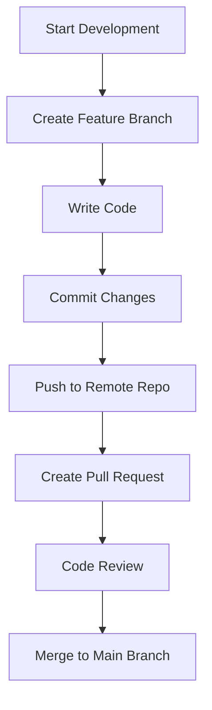
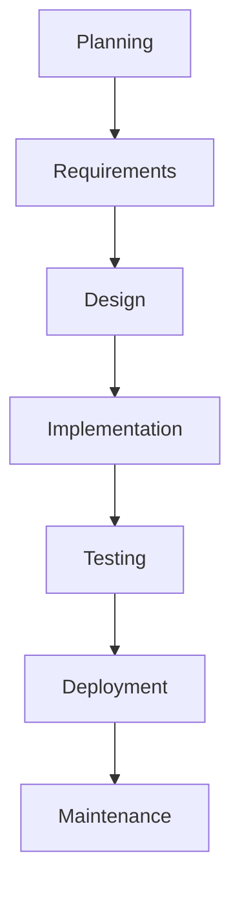
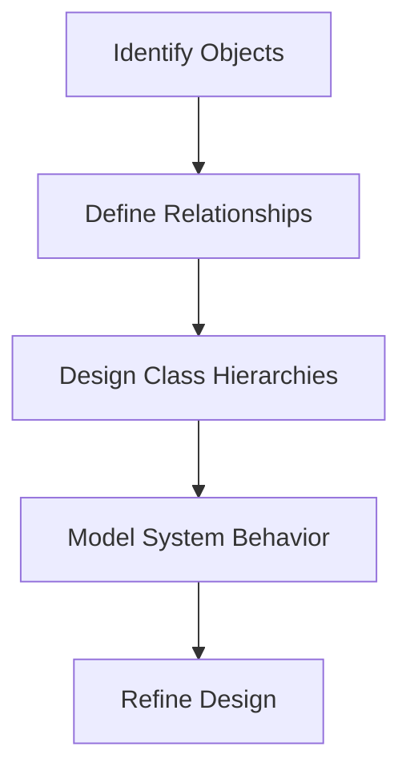
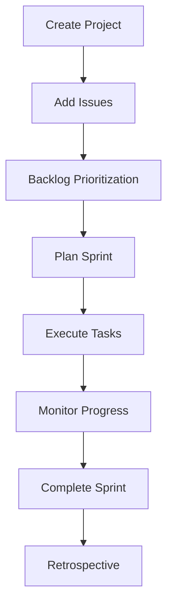
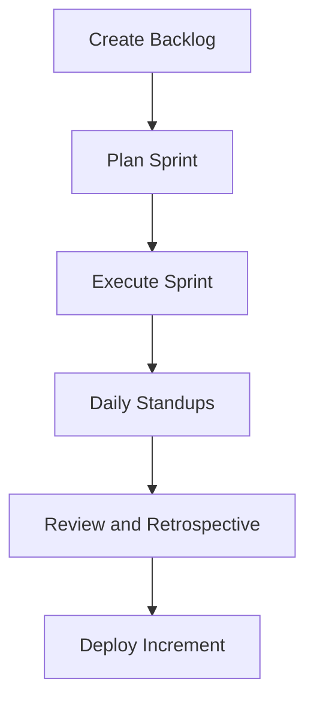
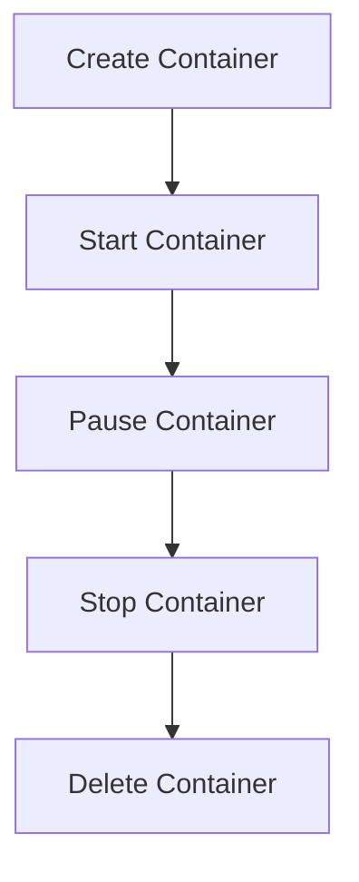

# Software Development Topics

## Developing an Application in a Team
Developing an application as a team requires collaboration, effective communication, and the use of proper tools and processes.

### Steps:
1. **Defining Requirements:** Collaboratively gather requirements from stakeholders.
2. **Assigning Roles and Responsibilities:** Roles include Product Owner, Team Lead, Developers, Testers, and DevOps.
3. **Establishing Workflow:** Use methodologies like Agile or Scrum.
4. **Code Development:** Break tasks into modules and adhere to coding standards.
5. **Code Reviews and Integration:** Use version control and conduct peer reviews.
6. **Testing:** Validate features using automated and manual testing.
7. **Deployment and Maintenance:** Use CI/CD pipelines and monitor performance.

---

## Issues Developers Face When Working in a Team

| **Category**           | **Issues**                                                                                     | **Solutions**                                                                      |
|-------------------------|-----------------------------------------------------------------------------------------------|------------------------------------------------------------------------------------|
| Communication           | Misunderstanding requirements or unclear instructions.                                        | Regular meetings, clear documentation, and tools like Slack or Microsoft Teams.    |
| Code Conflicts          | Overwriting each other’s code or resolving merge conflicts.                                   | Proper branch management and frequent commits with pull requests.                 |
| Different Skill Levels  | Varying levels of expertise leading to uneven task distribution.                              | Assign tasks based on skill and provide mentorship.                               |
| Integration Problems    | Issues when integrating individual components.                                                | Define clear integration points and conduct frequent testing.                     |
| Time Zone Differences   | Challenges in collaboration for distributed teams.                                            | Use asynchronous communication tools and schedule overlapping work hours.         |

---

## Introduction to Code Versioning System
A **Code Versioning System** (CVS) is a tool that helps developers track and manage changes to source code over time.

### Key Benefits:
- **Version History:** Keeps a record of changes.
- **Collaboration:** Allows multiple developers to work on the same project.
- **Backup:** Ensures code safety in case of errors.

---

## History of Code Versioning System

| **Year** | **Tool/Concept**        | **Description**                                                                              |
|----------|-------------------------|----------------------------------------------------------------------------------------------|
| 1972     | SCCS                    | First version control system; allowed basic tracking.                                        |
| 1982     | RCS                     | Introduced deltas to track changes.                                                         |
| 1990s    | CVS                     | Enabled concurrent editing and branching.                                                   |
| 2000     | Subversion (SVN)        | Improved upon CVS with better atomic commits and branching.                                 |
| 2005     | Git                     | Introduced distributed version control, speed, and powerful branching.                      |

### Different Tools for Versioning
1. **Git:** Open-source, distributed.
2. **SVN:** Centralized versioning system.
3. **Mercurial:** Similar to Git, distributed and user-friendly.
4. **Perforce:** Enterprise-grade versioning.

---

## Software Development Workflow
A typical **Git-based workflow**:
1. **Planning:** Requirements are gathered and tasks are divided.
2. **Branching:** Developers create branches for features.
3. **Coding:** Code is written and committed.
4. **Code Review:** Pull requests are reviewed by peers.
5. **Testing:** Automated or manual testing.
6. **Merging:** Code is merged into the main branch.
7. **Deployment:** CI/CD pipelines deploy the code.

---

## Introduction to Git
Git is a **distributed version control system** created by Linus Torvalds in 2005.

### Core Features:
- Branching and Merging.
- Distributed architecture.
- Data Integrity.

---

## Introduction to Git Repository and Git Structure

A **Git repository** is a storage space for your project, including:
1. **Working Directory:** Contains files currently being worked on.
2. **Staging Area:** Holds files that will be included in the next commit.
3. **Repository:** Stores all the committed changes.

| **Component**  | **Description**                                                                |
|-----------------|--------------------------------------------------------------------------------|
| `.git/`         | Hidden folder storing Git metadata.                                           |
| `HEAD`          | Points to the current branch.                                                 |
| `index`         | Tracks files in the staging area.                                             |

---

## Adding Code to Git
1. **Initialize Repository:**
   ```bash
   git init
   ```
2. **Stage Changes:**
   ```bash
   git add <file>
   ```
3. **Commit Changes:**
   ```bash
   git commit -m "Your commit message"
   ```

---

## Creating and Merging Different Git Branches
1. **Create a Branch:**
   ```bash
   git branch feature-branch
   git checkout feature-branch
   ```

2. **Merge Branch:**
   - Switch to the main branch:
     ```bash
     git checkout main
     ```
   - Merge the feature branch:
     ```bash
     git merge feature-branch
     ```

3. **Resolve Merge Conflicts:**
   - Open conflicting files.
   - Resolve conflicts manually.
   - Stage the resolved files and commit:
     ```bash
     git add <file>
     git commit -m "Resolved merge conflicts"
     ```

---

## Flowchart: Git Workflow



# Software Engineering Topics

## Introduction to Software Engineering
Software Engineering is a disciplined approach to the design, development, operation, and maintenance of software.

### Key Goals:
1. Develop software that meets customer requirements.
2. Ensure the software is cost-effective and maintainable.
3. Deliver the product on time.

---

## Software Process
A **Software Process** refers to a set of activities and associated results that produce a software product.

### Key Activities:
1. **Requirements Analysis:** Understanding and documenting what the software must do.
2. **Design:** Planning the structure and components of the software.
3. **Implementation:** Writing and testing the code.
4. **Testing:** Ensuring the software functions correctly.
5. **Maintenance:** Updating and improving the software after deployment.

---

## Software Process Model
A **Software Process Model** is a conceptual framework describing how software processes are organized.

### Common Models:
| **Model**       | **Description**                                                                             | **Advantages**                     | **Disadvantages**               |
|------------------|---------------------------------------------------------------------------------------------|-------------------------------------|----------------------------------|
| Waterfall        | Linear, sequential approach where each phase must be completed before the next begins.     | Simple to understand and manage.   | Rigid, not suitable for dynamic projects. |
| Agile            | Iterative and incremental model focusing on flexibility and customer collaboration.        | Adaptive, customer-focused.        | Requires constant customer involvement.   |
| Spiral           | Combines iterative development with risk analysis.                                         | Emphasizes risk reduction.         | Complex to manage.                        |
| V-Model          | Extension of the Waterfall model with a focus on testing.                                  | Testing is integral to every phase.| Rigid, not suitable for all projects.     |

---

## Software Product
A **Software Product** is the final deliverable of the software engineering process.

### Categories:
1. **Generic Products:** Software developed for a general audience (e.g., Microsoft Word).
2. **Customized Products:** Software tailored for specific customer requirements (e.g., Banking systems).

### Characteristics of a Good Software Product:
- **Functionality:** Meets the user's needs.
- **Reliability:** Performs consistently under defined conditions.
- **Usability:** Easy to use and understand.
- **Maintainability:** Easy to update and modify.
- **Efficiency:** Optimally uses resources.

---

## Importance of Software Engineering
Software Engineering is vital in today's technology-driven world.

### Reasons:
1. **Reduces Complexity:** Provides structured approaches to handle large, complex systems.
2. **Enhances Quality:** Ensures the software meets customer expectations.
3. **Increases Productivity:** Efficient processes enable faster development.
4. **Manages Costs:** Reduces development and maintenance costs.
5. **Addresses Scalability:** Allows systems to adapt to growing needs.
6. **Ensures Reliability:** Software performs consistently under various conditions.

---

## Software Development Life Cycles (SDLC)
The **Software Development Life Cycle (SDLC)** is a systematic process for developing software.

### Phases of SDLC:
| **Phase**           | **Description**                                                                                       |
|----------------------|-------------------------------------------------------------------------------------------------------|
| **1. Planning**      | Define objectives, scope, and feasibility.                                                           |
| **2. Requirements**  | Gather and document what the software must achieve.                                                  |
| **3. Design**        | Architect the system's structure, components, and interfaces.                                        |
| **4. Implementation**| Write code and convert design into a functioning system.                                             |
| **5. Testing**       | Verify that the software meets requirements and is free of defects.                                  |
| **6. Deployment**    | Release the software to production.                                                                  |
| **7. Maintenance**   | Update, optimize, and fix issues post-deployment.                                                    |

### Common SDLC Models:
| **Model**         | **Description**                                                                                                  | **Best Use Case**                                    |
|--------------------|------------------------------------------------------------------------------------------------------------------|-----------------------------------------------------|
| **Waterfall**      | Sequential and phase-dependent; each step must be completed before moving to the next.                         | Small projects with well-defined requirements.      |
| **Agile**          | Iterative, adaptive process focused on delivering small, incremental changes.                                   | Projects with rapidly changing requirements.        |
| **Spiral**         | Risk-driven approach combining iterative development and risk analysis.                                         | High-risk, large projects.                         |
| **Incremental**    | Software developed in increments, where each release adds functionality.                                        | Projects needing quick initial delivery.           |
| **V-Model**        | Verification and Validation model; focuses on testing at each phase of development.                            | Projects where quality is critical.                |

---

## Flowchart: SDLC Process



# Software Engineering Topics: Requirements and Design

## Requirements Engineering
Requirements Engineering is the process of defining, documenting, and maintaining the requirements for a software project.

### Types of Requirements
1. **Functional Requirements:** Define the functionalities the system must perform.
2. **Non-Functional Requirements:** Specify the quality attributes or constraints of the system.
3. **Domain Requirements:** Capture specific constraints or rules from the application domain.
4. **Business Requirements:** High-level objectives of the organization or client.

### Steps in Requirements Engineering
1. **Requirements Elicitation:** Gather requirements through interviews, surveys, and observation.
2. **Requirements Analysis:** Identify conflicts, refine requirements, and assess feasibility.
3. **Requirements Specification:** Document the requirements in a clear and structured format.
4. **Requirements Validation:** Ensure the documented requirements meet stakeholder needs.
5. **Requirements Management:** Maintain and track requirements throughout the development lifecycle.

### Requirement Analysis Modelling
- **Use Case Diagrams:** Capture interactions between users and the system.
- **Data Flow Diagrams (DFDs):** Represent data movement within the system.
- **Entity-Relationship Diagrams (ERDs):** Model data relationships.
- **Class Diagrams:** Show system classes and their relationships.

---

## Design and Architectural Engineering

### Characteristics of Good Design
1. **Clarity:** Easy to understand and communicate.
2. **Flexibility:** Adapts to future changes.
3. **Reusability:** Promotes reuse of components.
4. **Efficiency:** Optimally uses resources.
5. **Scalability:** Handles increasing demands effectively.

### Function-Oriented vs Object-Oriented Systems
| **Aspect**             | **Function-Oriented System**              | **Object-Oriented System**                  |
|-------------------------|-------------------------------------------|---------------------------------------------|
| **Focus**              | Functions or procedures.                  | Objects and their interactions.            |
| **Modularity**         | Based on functional decomposition.        | Based on objects encapsulating data/behavior.|
| **Reusability**        | Limited to procedural reuse.              | High due to object inheritance/polymorphism.|
| **Design Representation**| Data Flow Diagrams (DFD).               | Unified Modeling Language (UML).           |

### Key Concepts
1. **Modularity:** Dividing the system into smaller, manageable modules.
2. **Cohesion:** Degree to which elements within a module are related. (Higher cohesion = Better module design.)
3. **Coupling:** Measure of interdependence between modules. (Lower coupling = Better design.)
4. **Layering:** Structuring a system into layers (e.g., Presentation, Business Logic, Data Access).

### Design Models
1. **Architectural Models:** Define system components and their interactions.
2. **Component Models:** Represent individual modules.
3. **Dynamic Models:** Show system behavior over time (e.g., state diagrams).
4. **Deployment Models:** Illustrate physical deployment of components.

### Unified Modeling Language (UML)
- **Class Diagrams:** Represent classes and their relationships.
- **Sequence Diagrams:** Show interactions between objects over time.
- **Activity Diagrams:** Depict workflows.
- **State Diagrams:** Represent states and transitions of objects.

---

## Coding

### Programming Principles
1. **DRY (Don't Repeat Yourself):** Avoid code duplication.
2. **KISS (Keep It Simple, Stupid):** Simplify code as much as possible.
3. **SOLID Principles:** Single Responsibility, Open/Closed, Liskov Substitution, Interface Segregation, Dependency Inversion.

### Coding Conventions
1. Use meaningful variable names.
2. Follow consistent indentation.
3. Write comments for complex logic.
4. Adhere to naming conventions (e.g., camelCase for variables, PascalCase for classes).

---

## Object-Oriented Analysis and Design

### Steps in OOAD
1. **Identify Objects:** Determine entities relevant to the system.
2. **Define Relationships:** Establish relationships between objects.
3. **Design Class Hierarchies:** Use inheritance and polymorphism.
4. **Model System Behavior:** Use sequence diagrams, state diagrams, and activity diagrams.

### Flowchart: OOAD Process



# Agile Development Topics

## Introduction to Agile Development Model
Agile Development is a software development methodology focused on iterative development, flexibility, collaboration, and customer feedback.

### Key Principles of Agile
1. **Customer Collaboration:** Work closely with customers to meet their needs.
2. **Iterative Progress:** Deliver software incrementally in small, functional pieces.
3. **Responding to Change:** Adapt to changing requirements at any stage of development.
4. **Cross-Functional Teams:** Developers, testers, and stakeholders collaborate effectively.

---

## Agile Development Components

1. **User Stories:** Short descriptions of functionality from the user's perspective.
2. **Backlog:** A prioritized list of tasks and features to be completed.
3. **Sprints:** Short, time-boxed iterations (usually 1-4 weeks) where a set of tasks is completed.
4. **Daily Standups:** Short daily meetings to discuss progress, impediments, and plans.
5. **Retrospectives:** Regular reviews of the process to identify improvements.
6. **Scrum or Kanban Boards:** Visual tools to track task progress and workflow.

---

## Benefits of Agile

| **Aspect**           | **Benefits**                                                                                        |
|-----------------------|-----------------------------------------------------------------------------------------------------|
| **Flexibility**       | Adapts to changing requirements and priorities.                                                     |
| **Customer Satisfaction** | Frequent delivery of working software ensures client feedback is incorporated regularly.            |
| **Faster Delivery**   | Short sprints enable quicker deployment of usable features.                                         |
| **Team Collaboration**| Promotes strong communication and teamwork among cross-functional teams.                            |
| **Risk Management**   | Continuous delivery and feedback mitigate risks early in the development cycle.                     |

---

## Tools Used for Agile Web Development

1. **Jira:** Tracks issues, manages sprints, and visualizes workflows.
2. **Trello:** Provides Kanban-style boards for task management.
3. **Slack:** Facilitates team communication and file sharing.
4. **GitHub/GitLab:** Version control and collaboration tools for managing code.
5. **Confluence:** Documentation tool often used alongside Jira.
6. **Azure DevOps:** Integrates with Agile boards, repositories, and pipelines.

---

## Scrum and Extreme Programming

### Scrum
Scrum is a framework for managing Agile projects through iterative progress.

| **Aspect**             | **Description**                                                                                        |
|-------------------------|--------------------------------------------------------------------------------------------------------|
| **Roles**              | Product Owner, Scrum Master, Development Team.                                                        |
| **Artifacts**          | Product Backlog, Sprint Backlog, Increment.                                                           |
| **Ceremonies**         | Sprint Planning, Daily Scrum, Sprint Review, Sprint Retrospective.                                    |

### Extreme Programming (XP)
XP focuses on improving software quality and responsiveness to changing requirements.

| **Aspect**             | **Description**                                                                                        |
|-------------------------|--------------------------------------------------------------------------------------------------------|
| **Practices**          | Pair programming, test-driven development (TDD), continuous integration.                              |
| **Goals**              | Deliver high-quality software quickly and continuously.                                               |

---

## Introduction to Atlassian Jira

Jira is a project management tool widely used in Agile software development. It helps track and manage projects, tasks, and workflows.

### Adding a Project
1. Navigate to Jira’s dashboard.
2. Click **Create Project**.
3. Choose a template (e.g., Scrum, Kanban) and configure the settings.
4. Assign a team and set up a backlog.

### Adding Tasks and Sub-Tasks
1. Open the project and go to the backlog or board.
2. Click **Create Issue** to add a new task.
3. Assign tasks to team members and set priority levels.
4. Add sub-tasks under parent tasks for granular tracking.

### Creating Sprints with Tasks
1. From the backlog, select tasks to include in a sprint.
2. Click **Start Sprint**, set a duration (e.g., 2 weeks), and add sprint goals.
3. Monitor progress using the Sprint Board.

### JIRA for Agile Teams

#### **Scrum in JIRA**
1. Plan sprints using the backlog.
2. Track progress via the sprint board.
3. Conduct retrospectives using JIRA reports.

#### **Kanban in JIRA**
1. Define columns (e.g., To Do, In Progress, Testing, Done).
2. Set Work In Progress (WIP) limits to optimize workflow.
3. Track bottlenecks and ensure continuous delivery.

---

### Benefits of JIRA

1. **Streamlined Task Management:**
   - Centralized platform for all project-related tasks.
2. **Team Collaboration:**
   - Facilitates communication through comments and notifications.
3. **Scalability:**
   - Suitable for teams of all sizes, from startups to enterprises.
4. **Transparency:**
   - Provides real-time visibility into project progress.
5. **Integration:**
   - Connects seamlessly with tools like Confluence, Bitbucket, Slack, and GitHub.
---

### Best Practices for JIRA
1. Define clear workflows for your team.
2. Use epics to group related tasks.
3. Regularly groom the backlog to keep it up-to-date.
4. Leverage JIRA reports to monitor team performance.
5. Train team members to use JIRA effectively.

---

### Flowchart: JIRA Workflow Example

---

## Case Study: Developing a Web Application Using Agile Methodology

**Scenario:**
A team is tasked with developing an e-commerce website using Agile methodology.

### Step 1: Initial Planning
- Identify key features: User authentication, product catalog, shopping cart, and payment gateway.
- Create user stories, such as:
  - "As a user, I want to browse products by category."
  - "As a user, I want to securely check out using multiple payment methods."

### Step 2: Creating the Backlog
- Prioritize tasks in the backlog:
  - Set up database.
  - Implement user login.
  - Build product catalog.

### Step 3: Sprint Execution
- Sprint 1: Implement user login and basic database setup.
- Sprint 2: Add the product catalog and shopping cart functionality.
- Sprint 3: Integrate the payment gateway and deploy the application.

### Step 4: Review and Retrospectives
- Hold Sprint Reviews to demo completed work to stakeholders.
- Conduct Sprint Retrospectives to discuss improvements.

### Step 5: Deployment
- Deploy the application incrementally and gather user feedback.

---

## Flowchart: Agile Workflow



# DevOps and Containerization Topics

## Introduction to DevOps
DevOps is a set of practices, tools, and cultural philosophies aimed at automating and integrating the processes between software development (Dev) and IT operations (Ops). The primary goal of DevOps is to shorten the development lifecycle and deliver high-quality software continuously.


### Key Principles of DevOps
1. **Collaboration:** Improve communication between development and operations teams.
2. **Automation:** Automate repetitive tasks such as testing, deployment, and monitoring.
3. **Continuous Delivery (CD):** Ensure software is always in a deployable state.
4. **Customer-Centric Action:** Prioritize customer feedback in development cycles.

---

## DevOps Ecosystem
The DevOps ecosystem consists of various tools and technologies that enable DevOps practices. These tools are categorized based on their roles in the DevOps lifecycle.

| **Category**           | **Examples**                                                                                         |
|-------------------------|-----------------------------------------------------------------------------------------------------|
| **Version Control**     | Git, GitHub, GitLab, Bitbucket                                                                      |
| **Build Automation**    | Jenkins, CircleCI, Travis CI, Bamboo                                                               |
| **Containerization**    | Docker, Kubernetes                                                                                 |
| **Configuration Mgmt.** | Ansible, Chef, Puppet, Terraform                                                                    |
| **Monitoring**          | Prometheus, Grafana, ELK Stack (Elasticsearch, Logstash, Kibana)                                    |
| **Collaboration**       | Slack, Microsoft Teams, Jira                                                                       |

---

## DevOps Phases
DevOps phases can be represented as part of a continuous loop called the **DevOps Infinity Loop**. These phases include:

1. **Plan:** Define objectives and requirements.
2. **Develop:** Write and build code.
3. **Build:** Compile and integrate code.
4. **Test:** Validate functionality and performance.
5. **Release:** Package the application for deployment.
6. **Deploy:** Deploy the application in production.
7. **Operate:** Monitor and manage the production environment.
8. **Monitor:** Analyze logs and gather feedback for improvement.

---

## Introduction to Containerization
**Containerization** is the process of bundling an application and its dependencies into a single lightweight package called a **container**. Containers are isolated from each other but share the same operating system kernel, making them portable and efficient.


### Benefits of Containerization
1. **Portability:** Run containers on any environment (e.g., development, staging, production).
2. **Resource Efficiency:** Containers use fewer resources compared to virtual machines.
3. **Isolation:** Applications in containers run independently, reducing conflicts.

---

## Introduction to Docker
**Docker** is an open-source platform for developing, shipping, and running applications in containers. It simplifies container creation and management.


### Key Components of Docker
1. **Docker Engine:** Core runtime for managing containers.
2. **Docker Images:** Templates used to create containers.
3. **Docker Containers:** Running instances of Docker images.
4. **Docker Hub:** A repository for sharing and storing Docker images.

---

## Creating Docker Images Using Dockerfile
A **Dockerfile** is a text file containing instructions to build a Docker image.

### Steps to Create a Docker Image
1. **Write a Dockerfile:**

   Example:
   ```dockerfile
   # Base Image
   FROM python:3.9-slim
   
   # Set Working Directory
   WORKDIR /app
   
   # Copy Application Code
   COPY . /app
   
   # Install Dependencies
   RUN pip install -r requirements.txt
   
   # Expose Port
   EXPOSE 5000
   
   # Run Application
   CMD ["python", "app.py"]
   ```

2. **Build the Docker Image:**
   ```bash
   docker build -t my-python-app .
   ```

3. **Run the Docker Container:**
   ```bash
   docker run -p 5000:5000 my-python-app
   ```

---

## Container Life Cycle
The life cycle of a container involves the following states:

1. **Created:** The container is created but not running.
2. **Running:** The container is executing the specified process.
3. **Paused:** The container’s processes are paused.
4. **Stopped:** The container is stopped but still exists.
5. **Deleted:** The container is removed from the system.

### Container Management Commands
- **List Running Containers:**
  ```bash
  docker ps
  ```
- **Stop a Container:**
  ```bash
  docker stop <container_id>
  ```
- **Remove a Container:**
  ```bash
  docker rm <container_id>
  ```

---

## Flowchart: Docker Container Lifecycle

## AWS Docker Commands

### General Commands for AWS Docker:
- **`sudo apt update`**: Use this at the start of the Linux machine to update package lists.
- **`sudo apt install nodejs`**: Install Node.js on the system.
- **`sudo apt install npm`**: Install npm on the system.

### Docker Commands:
- **`sudo apt update`**: Use this at the start of the Linux machine to update package lists.
- **`docker -v`**: Check if Docker is installed.
- **`sudo apt install docker.io`**: Install Docker on the system.
- **`sudo docker status`**: Check the status of Docker.
- **`sudo docker images`**: List available images in Docker.
- **`sudo docker ps`**: List processes running in Docker.
- **`sudo docker pull hello-world`**: Pull the "hello-world" image from Docker Hub.
- **`sudo docker run hello-world`**: Run the "hello-world" image in Docker.

### Docker with GitHub:
1. **`sudo apt update`**: Update package lists.
2. **`docker -v`**: Verify Docker installation.
3. **`sudo apt install docker.io`**: Install Docker.
4. **`sudo docker status`**: Check Docker status.
5. **`git clone "repo name"`**: Clone the repository into the AWS instance.
6. **`sudo docker build -t "imagename"`**: Create a Docker image from the repository (replace `"imagename"` with your desired name). Ensure you are in the cloned repository folder; use `cd` to navigate if necessary.
   - Example: `sudo docker build -t tflstoreapp .`
7. **`sudo docker run --name tfl -d -p 8000:8000 tflstoreapp`**: Run the Docker container with specified configurations.
8. **`sudo docker rmi "image name"`**: Remove a Docker image.
9. **`sudo docker kill "container id"`**: Stop the container. This will remove the running container instance but leave the image intact.
10. **`sudo docker run`**: Restart the Docker container.

```
```
# **Introduction to YAML**

**YAML** (YAML Ain't Markup Language) is a human-readable data serialization standard used for configuration files and data exchange between programming languages. It is widely used in DevOps tools like Kubernetes, Ansible, and Docker Compose.

## **Features of YAML**
- **Human-friendly:** Designed to be easy to read and write.
- **Indentation-based:** Uses indentation to represent data hierarchy.
- **Data serialization:** Supports mapping, sequences, and scalars.
- **Language-agnostic:** Compatible with multiple programming languages.

## **YAML Syntax**
### 1. Scalars (Strings, Numbers, Booleans):
```yaml
name: John Doe
age: 30
is_developer: true
```

### 2. Lists (Sequences):
```yaml
skills:
  - Python
  - Java
  - Docker
```

### 3. Mappings (Dictionaries):
```yaml
address:
  street: 123 Main St
  city: Example City
```

### 4. Nested Structures:
```yaml
employee:
  name: Jane
  role:
    department: IT
    title: Engineer
```

## **YAML in DevOps**
### Docker Compose File Example:
```yaml
version: "3.8"
services:
  web:
    image: nginx
    ports:
      - "80:80"
  db:
    image: mysql
    environment:
      MYSQL_ROOT_PASSWORD: example
```

---

# **Introduction to Docker Swarm and Docker Stack**

## **Docker Swarm**
**Docker Swarm** is a native clustering and orchestration tool for Docker containers. It allows you to manage a group of Docker hosts as a single virtual server.

### **Key Features of Docker Swarm**
1. **Decentralized Design:** Nodes in a swarm can act as managers or workers.
2. **Service Discovery:** Automatically assigns tasks to nodes.
3. **Scaling:** Scale up or down services easily.
4. **Fault Tolerance:** Redistributes workloads if a node fails.

## **Docker Stack**
**Docker Stack** is a higher-level abstraction over Docker Swarm that uses a YAML-based configuration file (`docker-compose.yml`) to deploy multi-container applications.

### **Example: Deploying a Stack**
1. Create a `docker-compose.yml` file:
   ```yaml
   version: "3.8"
   services:
     web:
       image: nginx
       ports:
         - "80:80"
   ```
2. Deploy the stack:
   ```bash
   docker stack deploy -c docker-compose.yml my_stack
   ```

### **Flowchart: Docker Swarm Workflow**
```plaintext
Manager Node
   └── Worker Nodes
       ├── Containers
       ├── Services
       └── Tasks
```

---

# **Introduction to Kubernetes**

**Kubernetes** is an open-source container orchestration platform that automates the deployment, scaling, and management of containerized applications.

## **Key Features of Kubernetes**
1. **Automated Rollouts and Rollbacks:** Manages updates and failures.
2. **Scaling:** Horizontal scaling of applications.
3. **Self-Healing:** Restarts failed containers automatically.
4. **Service Discovery and Load Balancing:** Assigns IPs and load balances traffic.

## **Kubernetes Architecture**
### 1. Master Node:
   - API Server
   - Scheduler
   - Controller Manager
   - etcd (key-value store)
### 2. Worker Nodes:
   - Kubelet
   - Kube-proxy
   - Container Runtime

### **Diagram: Kubernetes Architecture**
```plaintext
API Server
   ├── Scheduler
   ├── etcd
   └── Nodes
       ├── Pod
       │   └── Container
       └── Kubelet
```


---

# **Creating Kubernetes Cluster**

## **Using `minikube` (Single Node Cluster)**

### Steps:
1. Install Minikube:
   ```bash
   curl -LO https://storage.googleapis.com/minikube/releases/latest/minikube-linux-amd64
   sudo install minikube-linux-amd64 /usr/local/bin/minikube
   ```

2. Start the cluster:
   ```bash
   minikube start
   ```

3. Verify:
   ```bash
   kubectl cluster-info
   ```

---

# **Creating Service in Kubernetes**

A **service** exposes an application running on a set of pods.

## **Example: Create a Service**

### 1. Create a deployment:
```yaml
apiVersion: apps/v1
kind: Deployment
metadata:
  name: nginx-deployment
spec:
  replicas: 2
  selector:
    matchLabels:
      app: nginx
  template:
    metadata:
      labels:
        app: nginx
    spec:
      containers:
      - name: nginx
        image: nginx:1.21
```

### 2. Expose as a service:
```bash
kubectl expose deployment nginx-deployment --type=LoadBalancer --name=nginx-service
```

### 3. View service:
```bash
kubectl get svc nginx-service
```

---

# **Deploying an Application Using Dashboard**

## **Step-by-Step Guide**

1. Enable the Kubernetes dashboard:
   ```bash
   minikube dashboard
   ```

2. Access the dashboard URL.

3. Deploy application:
   - Click **"Create" > "Upload YAML."**
   - Upload your YAML file.

4. Monitor Deployment:
   - Check the status of pods, services, and deployments.

---

Let me know if further details are needed or if you'd like more examples!

