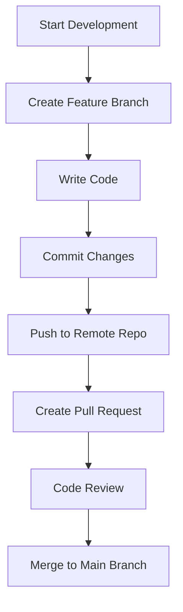
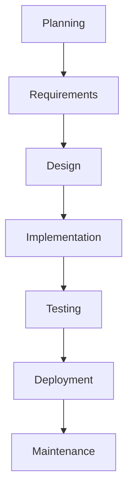
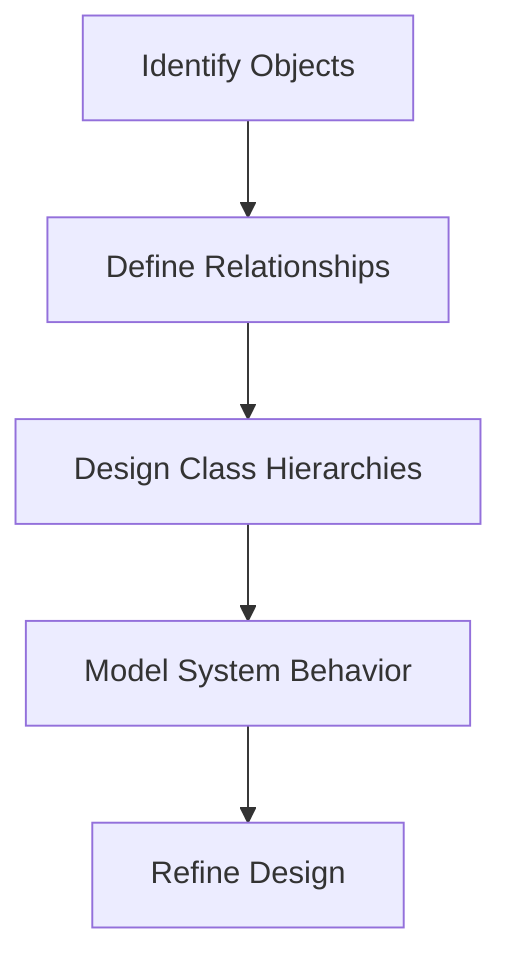

### Software Development Methodologies Notes

#### Definitions:

* **PAAS (Platform as a Service):** A cloud computing service that provides a platform allowing customers to develop, run, and manage applications without dealing with the infrastructure.
* **SAAS (Software as a Service):** A software distribution model where applications are hosted by a service provider and made available over the internet.

---

#### Solution Providers:

* **Organization:** CDAC Mumbai
* **Consultant:** Ravi Tambade

---

#### Collaboration Team Roles:

1. **Project Manager:**
   * Responsible for creating and managing project documents.

2. **Business Analyst:**
   * Prepares the Business Requirements Specification (BRS) using tools like:
     * Microsoft Word
     * Microsoft Excel

3. **System Analyst:**
   * Creates the System Requirements Specification (SRS) using tools like:
     * Microsoft Word
     * Microsoft Excel

4. **Designers:**
   * Responsible for UML diagrams using:
     * Star UML
     * IBM Rational Products

5. **Developers:**
   * Write and manage source code using tools and technologies:
     * IDEs: Visual Studio, Visual Studio Code, Eclipse, Spring Tool Suite (STS)
     * Build Tools: Maven, NuGet, npm
     * Installer Tools: Various installer tools
     * **Source Control Systems:**
       * **Git:** A distributed version control system used for:
         * Tracking changes in source code.
         * Collaboration among developers.
         * Managing branches and merging changes.
       * Other systems: SVN, etc.

6. **Testers:**
   * Focus Areas:
     * Write test cases and automation test scripts in Java, C#, and JavaScript.
   * Tools & Formats for Testing Environment Configuration:
     * YML files, batch files (.bat), shell scripts (.sh), PowerShell scripts.
   * Documentation of Results:
     * Test results and bug reports using Word, Excel, Google Spreadsheets, JSON, XML, and plain text.

7. **Software Support Engineers (IT Pro):**
   * Manage IT infrastructure documentation and specifications:
     * Docker files, JSON files, YAML files.
   * Develop automation scripts using:
     * Shell scripts, PowerShell scripts, batch files, etc.

---

#### Processes:

1. **SDLC (Software Development Life Cycle):**
   * **Model Used:** Waterfall Model
     * A sequential design process with defined stages such as Requirements, Design, Implementation, Testing, Deployment, and Maintenance.

2. **JIRA:**
   * A project management and issue-tracking tool widely used for:
     * Tracking bugs, tasks, and project progress.
     * Agile methodologies (Scrum and Kanban).
     * Integration with development and CI/CD tools.
    


# Software Development Topics

## Developing an Application in a Team
Developing an application as a team requires collaboration, effective communication, and the use of proper tools and processes.

### Steps:
1. **Defining Requirements:** Collaboratively gather requirements from stakeholders.
2. **Assigning Roles and Responsibilities:** Roles include Product Owner, Team Lead, Developers, Testers, and DevOps.
3. **Establishing Workflow:** Use methodologies like Agile or Scrum.
4. **Code Development:** Break tasks into modules and adhere to coding standards.
5. **Code Reviews and Integration:** Use version control and conduct peer reviews.
6. **Testing:** Validate features using automated and manual testing.
7. **Deployment and Maintenance:** Use CI/CD pipelines and monitor performance.

---

## Issues Developers Face When Working in a Team

| **Category**           | **Issues**                                                                                     | **Solutions**                                                                      |
|-------------------------|-----------------------------------------------------------------------------------------------|------------------------------------------------------------------------------------|
| Communication           | Misunderstanding requirements or unclear instructions.                                        | Regular meetings, clear documentation, and tools like Slack or Microsoft Teams.    |
| Code Conflicts          | Overwriting each other’s code or resolving merge conflicts.                                   | Proper branch management and frequent commits with pull requests.                 |
| Different Skill Levels  | Varying levels of expertise leading to uneven task distribution.                              | Assign tasks based on skill and provide mentorship.                               |
| Integration Problems    | Issues when integrating individual components.                                                | Define clear integration points and conduct frequent testing.                     |
| Time Zone Differences   | Challenges in collaboration for distributed teams.                                            | Use asynchronous communication tools and schedule overlapping work hours.         |

---

## Introduction to Code Versioning System
A **Code Versioning System** (CVS) is a tool that helps developers track and manage changes to source code over time.

### Key Benefits:
- **Version History:** Keeps a record of changes.
- **Collaboration:** Allows multiple developers to work on the same project.
- **Backup:** Ensures code safety in case of errors.

---

## History of Code Versioning System

| **Year** | **Tool/Concept**        | **Description**                                                                              |
|----------|-------------------------|----------------------------------------------------------------------------------------------|
| 1972     | SCCS                    | First version control system; allowed basic tracking.                                        |
| 1982     | RCS                     | Introduced deltas to track changes.                                                         |
| 1990s    | CVS                     | Enabled concurrent editing and branching.                                                   |
| 2000     | Subversion (SVN)        | Improved upon CVS with better atomic commits and branching.                                 |
| 2005     | Git                     | Introduced distributed version control, speed, and powerful branching.                      |

### Different Tools for Versioning
1. **Git:** Open-source, distributed.
2. **SVN:** Centralized versioning system.
3. **Mercurial:** Similar to Git, distributed and user-friendly.
4. **Perforce:** Enterprise-grade versioning.

---

## Software Development Workflow
A typical **Git-based workflow**:
1. **Planning:** Requirements are gathered and tasks are divided.
2. **Branching:** Developers create branches for features.
3. **Coding:** Code is written and committed.
4. **Code Review:** Pull requests are reviewed by peers.
5. **Testing:** Automated or manual testing.
6. **Merging:** Code is merged into the main branch.
7. **Deployment:** CI/CD pipelines deploy the code.

---

## Introduction to Git
Git is a **distributed version control system** created by Linus Torvalds in 2005.

### Core Features:
- Branching and Merging.
- Distributed architecture.
- Data Integrity.

---

## Introduction to Git Repository and Git Structure

A **Git repository** is a storage space for your project, including:
1. **Working Directory:** Contains files currently being worked on.
2. **Staging Area:** Holds files that will be included in the next commit.
3. **Repository:** Stores all the committed changes.

| **Component**  | **Description**                                                                |
|-----------------|--------------------------------------------------------------------------------|
| `.git/`         | Hidden folder storing Git metadata.                                           |
| `HEAD`          | Points to the current branch.                                                 |
| `index`         | Tracks files in the staging area.                                             |

---

## Adding Code to Git
1. **Initialize Repository:**
   ```bash
   git init
   ```
2. **Stage Changes:**
   ```bash
   git add <file>
   ```
3. **Commit Changes:**
   ```bash
   git commit -m "Your commit message"
   ```

---

## Creating and Merging Different Git Branches
1. **Create a Branch:**
   ```bash
   git branch feature-branch
   git checkout feature-branch
   ```

2. **Merge Branch:**
   - Switch to the main branch:
     ```bash
     git checkout main
     ```
   - Merge the feature branch:
     ```bash
     git merge feature-branch
     ```

3. **Resolve Merge Conflicts:**
   - Open conflicting files.
   - Resolve conflicts manually.
   - Stage the resolved files and commit:
     ```bash
     git add <file>
     git commit -m "Resolved merge conflicts"
     ```

---

## Flowchart: Git Workflow



# Software Engineering Topics

## Introduction to Software Engineering
Software Engineering is a disciplined approach to the design, development, operation, and maintenance of software.

### Key Goals:
1. Develop software that meets customer requirements.
2. Ensure the software is cost-effective and maintainable.
3. Deliver the product on time.

---

## Software Process
A **Software Process** refers to a set of activities and associated results that produce a software product.

### Key Activities:
1. **Requirements Analysis:** Understanding and documenting what the software must do.
2. **Design:** Planning the structure and components of the software.
3. **Implementation:** Writing and testing the code.
4. **Testing:** Ensuring the software functions correctly.
5. **Maintenance:** Updating and improving the software after deployment.

---

## Software Process Model
A **Software Process Model** is a conceptual framework describing how software processes are organized.

### Common Models:
| **Model**       | **Description**                                                                             | **Advantages**                     | **Disadvantages**               |
|------------------|---------------------------------------------------------------------------------------------|-------------------------------------|----------------------------------|
| Waterfall        | Linear, sequential approach where each phase must be completed before the next begins.     | Simple to understand and manage.   | Rigid, not suitable for dynamic projects. |
| Agile            | Iterative and incremental model focusing on flexibility and customer collaboration.        | Adaptive, customer-focused.        | Requires constant customer involvement.   |
| Spiral           | Combines iterative development with risk analysis.                                         | Emphasizes risk reduction.         | Complex to manage.                        |
| V-Model          | Extension of the Waterfall model with a focus on testing.                                  | Testing is integral to every phase.| Rigid, not suitable for all projects.     |

---

## Software Product
A **Software Product** is the final deliverable of the software engineering process.

### Categories:
1. **Generic Products:** Software developed for a general audience (e.g., Microsoft Word).
2. **Customized Products:** Software tailored for specific customer requirements (e.g., Banking systems).

### Characteristics of a Good Software Product:
- **Functionality:** Meets the user's needs.
- **Reliability:** Performs consistently under defined conditions.
- **Usability:** Easy to use and understand.
- **Maintainability:** Easy to update and modify.
- **Efficiency:** Optimally uses resources.

---

## Importance of Software Engineering
Software Engineering is vital in today's technology-driven world.

### Reasons:
1. **Reduces Complexity:** Provides structured approaches to handle large, complex systems.
2. **Enhances Quality:** Ensures the software meets customer expectations.
3. **Increases Productivity:** Efficient processes enable faster development.
4. **Manages Costs:** Reduces development and maintenance costs.
5. **Addresses Scalability:** Allows systems to adapt to growing needs.
6. **Ensures Reliability:** Software performs consistently under various conditions.

---

## Software Development Life Cycles (SDLC)
The **Software Development Life Cycle (SDLC)** is a systematic process for developing software.

### Phases of SDLC:
| **Phase**           | **Description**                                                                                       |
|----------------------|-------------------------------------------------------------------------------------------------------|
| **1. Planning**      | Define objectives, scope, and feasibility.                                                           |
| **2. Requirements**  | Gather and document what the software must achieve.                                                  |
| **3. Design**        | Architect the system's structure, components, and interfaces.                                        |
| **4. Implementation**| Write code and convert design into a functioning system.                                             |
| **5. Testing**       | Verify that the software meets requirements and is free of defects.                                  |
| **6. Deployment**    | Release the software to production.                                                                  |
| **7. Maintenance**   | Update, optimize, and fix issues post-deployment.                                                    |

### Common SDLC Models:
| **Model**         | **Description**                                                                                                  | **Best Use Case**                                    |
|--------------------|------------------------------------------------------------------------------------------------------------------|-----------------------------------------------------|
| **Waterfall**      | Sequential and phase-dependent; each step must be completed before moving to the next.                         | Small projects with well-defined requirements.      |
| **Agile**          | Iterative, adaptive process focused on delivering small, incremental changes.                                   | Projects with rapidly changing requirements.        |
| **Spiral**         | Risk-driven approach combining iterative development and risk analysis.                                         | High-risk, large projects.                         |
| **Incremental**    | Software developed in increments, where each release adds functionality.                                        | Projects needing quick initial delivery.           |
| **V-Model**        | Verification and Validation model; focuses on testing at each phase of development.                            | Projects where quality is critical.                |

---

## Flowchart: SDLC Process



# Software Engineering Topics: Requirements and Design

## Requirements Engineering
Requirements Engineering is the process of defining, documenting, and maintaining the requirements for a software project.

### Types of Requirements
1. **Functional Requirements:** Define the functionalities the system must perform.
2. **Non-Functional Requirements:** Specify the quality attributes or constraints of the system.
3. **Domain Requirements:** Capture specific constraints or rules from the application domain.
4. **Business Requirements:** High-level objectives of the organization or client.

### Steps in Requirements Engineering
1. **Requirements Elicitation:** Gather requirements through interviews, surveys, and observation.
2. **Requirements Analysis:** Identify conflicts, refine requirements, and assess feasibility.
3. **Requirements Specification:** Document the requirements in a clear and structured format.
4. **Requirements Validation:** Ensure the documented requirements meet stakeholder needs.
5. **Requirements Management:** Maintain and track requirements throughout the development lifecycle.

### Requirement Analysis Modelling
- **Use Case Diagrams:** Capture interactions between users and the system.
- **Data Flow Diagrams (DFDs):** Represent data movement within the system.
- **Entity-Relationship Diagrams (ERDs):** Model data relationships.
- **Class Diagrams:** Show system classes and their relationships.

---

## Design and Architectural Engineering

### Characteristics of Good Design
1. **Clarity:** Easy to understand and communicate.
2. **Flexibility:** Adapts to future changes.
3. **Reusability:** Promotes reuse of components.
4. **Efficiency:** Optimally uses resources.
5. **Scalability:** Handles increasing demands effectively.

### Function-Oriented vs Object-Oriented Systems
| **Aspect**             | **Function-Oriented System**              | **Object-Oriented System**                  |
|-------------------------|-------------------------------------------|---------------------------------------------|
| **Focus**              | Functions or procedures.                  | Objects and their interactions.            |
| **Modularity**         | Based on functional decomposition.        | Based on objects encapsulating data/behavior.|
| **Reusability**        | Limited to procedural reuse.              | High due to object inheritance/polymorphism.|
| **Design Representation**| Data Flow Diagrams (DFD).               | Unified Modeling Language (UML).           |

### Key Concepts
1. **Modularity:** Dividing the system into smaller, manageable modules.
2. **Cohesion:** Degree to which elements within a module are related. (Higher cohesion = Better module design.)
3. **Coupling:** Measure of interdependence between modules. (Lower coupling = Better design.)
4. **Layering:** Structuring a system into layers (e.g., Presentation, Business Logic, Data Access).

### Design Models
1. **Architectural Models:** Define system components and their interactions.
2. **Component Models:** Represent individual modules.
3. **Dynamic Models:** Show system behavior over time (e.g., state diagrams).
4. **Deployment Models:** Illustrate physical deployment of components.

### Unified Modeling Language (UML)
- **Class Diagrams:** Represent classes and their relationships.
- **Sequence Diagrams:** Show interactions between objects over time.
- **Activity Diagrams:** Depict workflows.
- **State Diagrams:** Represent states and transitions of objects.

---

## Coding

### Programming Principles
1. **DRY (Don't Repeat Yourself):** Avoid code duplication.
2. **KISS (Keep It Simple, Stupid):** Simplify code as much as possible.
3. **SOLID Principles:** Single Responsibility, Open/Closed, Liskov Substitution, Interface Segregation, Dependency Inversion.

### Coding Conventions
1. Use meaningful variable names.
2. Follow consistent indentation.
3. Write comments for complex logic.
4. Adhere to naming conventions (e.g., camelCase for variables, PascalCase for classes).

---

## Object-Oriented Analysis and Design

### Steps in OOAD
1. **Identify Objects:** Determine entities relevant to the system.
2. **Define Relationships:** Establish relationships between objects.
3. **Design Class Hierarchies:** Use inheritance and polymorphism.
4. **Model System Behavior:** Use sequence diagrams, state diagrams, and activity diagrams.

### Flowchart: OOAD Process

