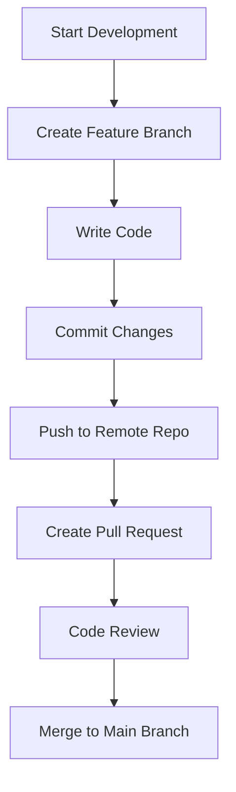

### Software Development Methodologies Notes

#### Definitions:

* **PAAS (Platform as a Service):** A cloud computing service that provides a platform allowing customers to develop, run, and manage applications without dealing with the infrastructure.
* **SAAS (Software as a Service):** A software distribution model where applications are hosted by a service provider and made available over the internet.

---

#### Solution Providers:

* **Organization:** CDAC Mumbai
* **Consultant:** Ravi Tambade

---

#### Collaboration Team Roles:

1. **Project Manager:**
   * Responsible for creating and managing project documents.

2. **Business Analyst:**
   * Prepares the Business Requirements Specification (BRS) using tools like:
     * Microsoft Word
     * Microsoft Excel

3. **System Analyst:**
   * Creates the System Requirements Specification (SRS) using tools like:
     * Microsoft Word
     * Microsoft Excel

4. **Designers:**
   * Responsible for UML diagrams using:
     * Star UML
     * IBM Rational Products

5. **Developers:**
   * Write and manage source code using tools and technologies:
     * IDEs: Visual Studio, Visual Studio Code, Eclipse, Spring Tool Suite (STS)
     * Build Tools: Maven, NuGet, npm
     * Installer Tools: Various installer tools
     * **Source Control Systems:**
       * **Git:** A distributed version control system used for:
         * Tracking changes in source code.
         * Collaboration among developers.
         * Managing branches and merging changes.
       * Other systems: SVN, etc.

6. **Testers:**
   * Focus Areas:
     * Write test cases and automation test scripts in Java, C#, and JavaScript.
   * Tools & Formats for Testing Environment Configuration:
     * YML files, batch files (.bat), shell scripts (.sh), PowerShell scripts.
   * Documentation of Results:
     * Test results and bug reports using Word, Excel, Google Spreadsheets, JSON, XML, and plain text.

7. **Software Support Engineers (IT Pro):**
   * Manage IT infrastructure documentation and specifications:
     * Docker files, JSON files, YAML files.
   * Develop automation scripts using:
     * Shell scripts, PowerShell scripts, batch files, etc.

---

#### Processes:

1. **SDLC (Software Development Life Cycle):**
   * **Model Used:** Waterfall Model
     * A sequential design process with defined stages such as Requirements, Design, Implementation, Testing, Deployment, and Maintenance.

2. **JIRA:**
   * A project management and issue-tracking tool widely used for:
     * Tracking bugs, tasks, and project progress.
     * Agile methodologies (Scrum and Kanban).
     * Integration with development and CI/CD tools.
    


# Software Development Topics

## Developing an Application in a Team
Developing an application as a team requires collaboration, effective communication, and the use of proper tools and processes.

### Steps:
1. **Defining Requirements:** Collaboratively gather requirements from stakeholders.
2. **Assigning Roles and Responsibilities:** Roles include Product Owner, Team Lead, Developers, Testers, and DevOps.
3. **Establishing Workflow:** Use methodologies like Agile or Scrum.
4. **Code Development:** Break tasks into modules and adhere to coding standards.
5. **Code Reviews and Integration:** Use version control and conduct peer reviews.
6. **Testing:** Validate features using automated and manual testing.
7. **Deployment and Maintenance:** Use CI/CD pipelines and monitor performance.

---

## Issues Developers Face When Working in a Team

| **Category**           | **Issues**                                                                                     | **Solutions**                                                                      |
|-------------------------|-----------------------------------------------------------------------------------------------|------------------------------------------------------------------------------------|
| Communication           | Misunderstanding requirements or unclear instructions.                                        | Regular meetings, clear documentation, and tools like Slack or Microsoft Teams.    |
| Code Conflicts          | Overwriting each other’s code or resolving merge conflicts.                                   | Proper branch management and frequent commits with pull requests.                 |
| Different Skill Levels  | Varying levels of expertise leading to uneven task distribution.                              | Assign tasks based on skill and provide mentorship.                               |
| Integration Problems    | Issues when integrating individual components.                                                | Define clear integration points and conduct frequent testing.                     |
| Time Zone Differences   | Challenges in collaboration for distributed teams.                                            | Use asynchronous communication tools and schedule overlapping work hours.         |

---

## Introduction to Code Versioning System
A **Code Versioning System** (CVS) is a tool that helps developers track and manage changes to source code over time.

### Key Benefits:
- **Version History:** Keeps a record of changes.
- **Collaboration:** Allows multiple developers to work on the same project.
- **Backup:** Ensures code safety in case of errors.

---

## History of Code Versioning System

| **Year** | **Tool/Concept**        | **Description**                                                                              |
|----------|-------------------------|----------------------------------------------------------------------------------------------|
| 1972     | SCCS                    | First version control system; allowed basic tracking.                                        |
| 1982     | RCS                     | Introduced deltas to track changes.                                                         |
| 1990s    | CVS                     | Enabled concurrent editing and branching.                                                   |
| 2000     | Subversion (SVN)        | Improved upon CVS with better atomic commits and branching.                                 |
| 2005     | Git                     | Introduced distributed version control, speed, and powerful branching.                      |

### Different Tools for Versioning
1. **Git:** Open-source, distributed.
2. **SVN:** Centralized versioning system.
3. **Mercurial:** Similar to Git, distributed and user-friendly.
4. **Perforce:** Enterprise-grade versioning.

---

## Software Development Workflow
A typical **Git-based workflow**:
1. **Planning:** Requirements are gathered and tasks are divided.
2. **Branching:** Developers create branches for features.
3. **Coding:** Code is written and committed.
4. **Code Review:** Pull requests are reviewed by peers.
5. **Testing:** Automated or manual testing.
6. **Merging:** Code is merged into the main branch.
7. **Deployment:** CI/CD pipelines deploy the code.

---

## Introduction to Git
Git is a **distributed version control system** created by Linus Torvalds in 2005.

### Core Features:
- Branching and Merging.
- Distributed architecture.
- Data Integrity.

---

## Introduction to Git Repository and Git Structure

A **Git repository** is a storage space for your project, including:
1. **Working Directory:** Contains files currently being worked on.
2. **Staging Area:** Holds files that will be included in the next commit.
3. **Repository:** Stores all the committed changes.

| **Component**  | **Description**                                                                |
|-----------------|--------------------------------------------------------------------------------|
| `.git/`         | Hidden folder storing Git metadata.                                           |
| `HEAD`          | Points to the current branch.                                                 |
| `index`         | Tracks files in the staging area.                                             |

---

## Adding Code to Git
1. **Initialize Repository:**
   ```bash
   git init
   ```
2. **Stage Changes:**
   ```bash
   git add <file>
   ```
3. **Commit Changes:**
   ```bash
   git commit -m "Your commit message"
   ```

---

## Creating and Merging Different Git Branches
1. **Create a Branch:**
   ```bash
   git branch feature-branch
   git checkout feature-branch
   ```

2. **Merge Branch:**
   - Switch to the main branch:
     ```bash
     git checkout main
     ```
   - Merge the feature branch:
     ```bash
     git merge feature-branch
     ```

3. **Resolve Merge Conflicts:**
   - Open conflicting files.
   - Resolve conflicts manually.
   - Stage the resolved files and commit:
     ```bash
     git add <file>
     git commit -m "Resolved merge conflicts"
     ```

---

## Flowchart: Git Workflow



